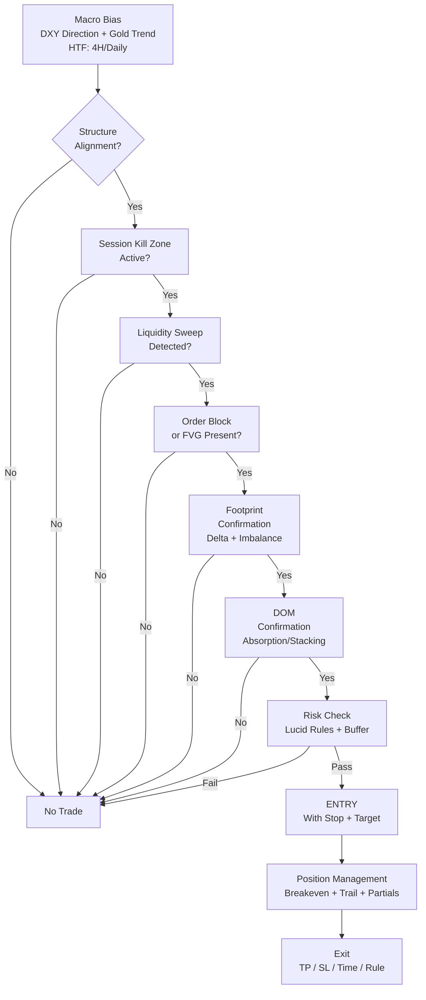
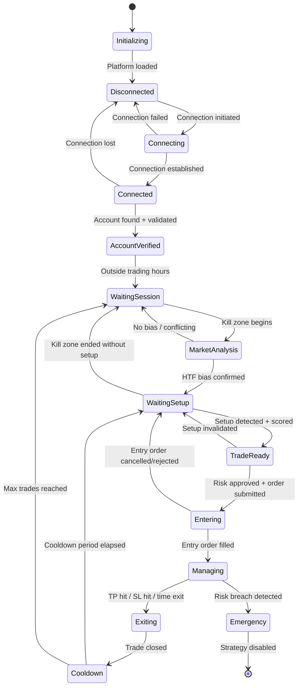

## ⚠️ Critical Disclaimer

This document contains architectural guidance and conceptual frameworks. All Lucid Trading rule parameters (drawdown limits, profit targets, contract limits, etc.) **must be verified directly against the current official Lucid Trading documentation** before each build cycle, as prop firm rules change frequently. All Quantower SDK APIs **must be verified against the installed SDK version**. Never assume rule values — always read them programmatically or from a regularly-refreshed configuration source.

---

## Table of Contents

1. [Quantower Platform Architecture](#1-quantower-platform-architecture)
2. [Quantower Algo Development](#2-quantower-algo-development)
3. [Quantower SDK Deep Reference](#3-quantower-sdk-deep-reference)
4. [Lucid Trading Knowledge Base](#4-lucid-trading-knowledge-base)
5. [Account Detection Engine](#5-account-detection-engine)
6. [Futures Market Knowledge](#6-futures-market-knowledge)
7. [Gold Market Structure](#7-gold-market-structure)
8. [ICT Concepts Reference](#8-ict-concepts-reference)
9. [Smart Money Concepts (SMC)](#9-smart-money-concepts-smc)
10. [Price Action Framework](#10-price-action-framework)
11. [Order Flow Analysis](#11-order-flow-analysis)
12. [Strategy Design Architecture](#12-strategy-design-architecture)
13. [Risk Management Engine](#13-risk-management-engine)
14. [Position Management Framework](#14-position-management-framework)
15. [Performance Optimization](#15-performance-optimization)
16. [Backtesting Framework](#16-backtesting-framework)
17. [AI Integration Layer](#17-ai-integration-layer)
18. [Software Engineering Architecture](#18-software-engineering-architecture)
19. [Trading State Machine](#19-trading-state-machine)
20. [Project Folder Structure](#20-project-folder-structure)
21. [Glossary](#21-glossary)
22. [Checklists & Validation Procedures](#22-checklists--validation-procedures)
23. [Troubleshooting Guide](#23-troubleshooting-guide)
24. [References](#24-references)

---

## 1. Quantower Platform Architecture

### 1.1 Overview

Quantower is a professional multi-broker, multi-asset trading platform built on .NET (Windows). It is not a web application — it is a native Windows desktop application that communicates with exchanges, brokers, and data vendors through modular connection adapters. Its architecture is plugin-based, meaning nearly every functional component (chart panels, DOM panels, strategies) is loaded as a managed .NET assembly.

```
┌─────────────────────────────────────────────────────────────┐
│                    QUANTOWER PLATFORM                        │
│                                                             │
│  ┌──────────┐  ┌──────────┐  ┌──────────┐  ┌──────────┐   │
│  │  Charts  │  │   DOM    │  │Footprint │  │ Vol.Prof │   │
│  └──────────┘  └──────────┘  └──────────┘  └──────────┘   │
│  ┌──────────┐  ┌──────────┐  ┌──────────┐  ┌──────────┐   │
│  │  T&S     │  │ Level 2  │  │ SmartDOM │  │ Strategy │   │
│  └──────────┘  └──────────┘  └──────────┘  └──────────┘   │
│                                                             │
│  ┌─────────────────────────────────────────────────────┐   │
│  │              TRADING ENGINE CORE                     │   │
│  │  Order Router │ Risk Engine │ Position Tracker       │   │
│  └─────────────────────────────────────────────────────┘   │
│                                                             │
│  ┌─────────────────────────────────────────────────────┐   │
│  │           CONNECTION ADAPTER LAYER                   │   │
│  │  Rithmic │ CQG │ DxFeed │ Interactive Brokers        │   │
│  └─────────────────────────────────────────────────────┘   │
└─────────────────────────────────────────────────────────────┘
```

### 1.2 Core Components

#### 1.2.1 Trading Engine
The trading engine is the central nervous system of Quantower. It handles:
- Order lifecycle management (New → Pending → Working → Filled/Cancelled/Rejected)
- Position aggregation across instruments and accounts
- P&L calculation (realized and unrealized)
- Risk checks at the order submission layer
- Commission and fee modeling
- Cross-account and cross-connection portfolio aggregation

The engine is event-driven, firing events on every state change. Your strategy code subscribes to these events and reacts asynchronously.

#### 1.2.2 Workspace
The Workspace is the top-level organizational unit in Quantower. It contains panels, connections, and layout configurations. A workspace is saved as an XML/JSON file on disk. When building autonomous strategies, your strategy panel appears as a dedicated panel within a workspace.

#### 1.2.3 DOM (Depth of Market)
The DOM displays the order book — all limit orders resting at each price level. In Quantower:
- **Standard DOM:** Displays bid/ask at each price level, volume at level, cumulative volume
- **Smart DOM:** Enhanced DOM with order flow visualization, delta at each level, recent trade aggression indicators, DOM imbalance highlights, large-lot highlighting, and one-click trading

DOM data flows from the connection adapter (Rithmic's PITCH feed for CME instruments). Latency from exchange to DOM display is connection-dependent.

**Key DOM Concepts:**
- **Bid Stack:** Limit buy orders resting below market
- **Ask Stack:** Limit sell orders resting above market
- **Spread:** Distance between best bid and best ask
- **DOM Imbalance:** When one side has significantly more size than the other at adjacent levels — often a leading indicator of short-term price movement
- **Pulling:** When large limit orders disappear without trading — indicates fake support/resistance
- **Stacking:** When new limit orders are added layer by layer on one side — indicates institutional commitment
- **Absorption:** When aggressive orders hit a large passive limit order and price does not move — the passive order is absorbing flow

#### 1.2.4 Footprint Chart
The Footprint (also called Cluster Chart) is the most important order-flow visualization tool. Each candle is decomposed into individual price levels, showing:

```
Price  | Sells × Buys  | Delta
-------------------------------
2350.0 | 45  × 112     | +67
2349.8 | 88  × 34      | -54
2349.6 | 23  × 67      | +44
2349.4 | 134 × 12      | -122  ← Significant selling
2349.2 | 18  × 89      | +71
```

Types of Footprint cells:
- **Bid × Ask cell:** Shows contracts traded at bid (seller-initiated) vs ask (buyer-initiated)
- **Delta cell:** Net delta (Buys - Sells) at that price level
- **Volume cell:** Total volume at that level

Key footprint patterns:
- **Diagonal:** Delta shifts sharply in one direction across multiple levels — indicates institutional aggression
- **Stacked Imbalance:** Multiple consecutive levels with dominant delta on one side — high-conviction directional move
- **Unfinished Auction:** Price left a price level with more aggression than trades — market is likely to return
- **Absorption at Extreme:** Heavy selling at a swing high with price refusing to move lower — institutional buyers absorbing

#### 1.2.5 Volume Profile
Volume Profile distributes trading volume across price levels rather than time. It answers: "At what price did the most trading occur?"

Key concepts:
- **POC (Point of Control):** Price level with the highest traded volume — acts as a magnet and key S/R
- **VAH (Value Area High):** Upper boundary of the zone containing 70% of traded volume
- **VAL (Value Area Low):** Lower boundary of the value area
- **Value Area (VA):** The range between VAH and VAL — price trades here ~70% of time
- **HVN (High Volume Node):** Cluster of high volume at a price range — strong support/resistance
- **LVN (Low Volume Node):** Thin area with little volume — price tends to move quickly through LVNs

Profile types in Quantower:
- **Session Profile:** Volume for a single trading session
- **Composite Profile:** Volume across multiple sessions
- **TPO (Time Price Opportunity):** Market Profile letters showing when price visited each level (30-min blocks)
- **Fixed Range Profile:** Volume for a user-defined price range or bar range

#### 1.2.6 Level 2 / Market Depth
Displays all visible resting orders across multiple price levels from the exchange's order book. For CME instruments via Rithmic, you receive up to 10 levels of depth (or full depth depending on data subscription). This is the raw data that feeds the DOM visualization.

#### 1.2.7 Time & Sales (Tape)
The Time & Sales panel shows every trade print in real-time:
- Timestamp
- Price
- Volume (contracts)
- Side (aggressor: Buy or Sell)
- Condition flags (e.g., spread trade, block trade)

**Smart Tape:** Quantower's enhanced T&S that filters, highlights, and stacks prints. Configurable to show only large lots (e.g., ≥50 contracts on MGC), color-code aggression, and aggregate sequential prints at the same price.

#### 1.2.8 Connections

**Rithmic:**
- Primary connection for CME/COMEX futures
- Two protocols: R|API+ (legacy) and RProtocol (modern)
- Provides: Level 1, Level 2 (full DOM), Time & Sales, Order Routing, Historical Data, Account Data
- Low-latency co-location options available for professional accounts
- Data feed: CME Globex, COMEX
- **Required for MGC and GC trading**

**CQG:**
- Alternative to Rithmic for CME futures
- Generally slightly higher latency than Rithmic for Chicago-based instruments
- Strong historical data

**DxFeed:**
- Data vendor for market data (not a broker)
- Provides extended market data subscriptions
- Used for additional data feeds when needed

**Interactive Brokers:**
- Supported for equities, options, and some futures
- Generally not used for prop firm futures evaluation accounts

### 1.3 Market Replay
Quantower includes a Market Replay module that replays historical tick data through the platform as if it were live. This allows you to:
- Test strategy behavior on historical data with full DOM, Footprint, and T&S reconstruction
- Verify order flow logic against real historical market microstructure
- Debug strategy edge cases
- **Limitation:** Replay does not perfectly reconstruct the order book — DOM replay is an approximation. Footprint and T&S replay is accurate.

### 1.4 Strategy Tester
The Strategy Tester backtests C# strategies against historical data. It simulates order execution using historical tick data and generates performance reports. Limitations:
- Fill simulation is an approximation (real market impact is not modeled)
- DOM-dependent logic cannot be accurately backtested
- Slippage models are simplistic by default

---

## 2. Quantower Algo Development

### 2.1 Technology Stack

| Component | Technology |
|-----------|-----------|
| Language | C# 9.0+ |
| Runtime | .NET 5 / .NET 6 (verify against installed Quantower version) |
| IDE | Visual Studio 2022 (recommended) or JetBrains Rider |
| SDK | TradingPlatform.BusinessLayer NuGet package |
| Build | MSBuild / dotnet CLI |
| Testing | NUnit or xUnit with Moq for mocking |
| Logging | ILog (SDK built-in) + Serilog for file sinks |

### 2.2 Project Structure Foundation

A Quantower strategy is a .NET class library (DLL) that implements `Strategy` base class from the SDK. It is loaded dynamically by the Quantower platform at runtime.

```xml
<!-- .csproj skeleton -->
<Project Sdk="Microsoft.NET.Sdk">
  <PropertyGroup>
    <TargetFramework>net6.0-windows</TargetFramework>
    <Nullable>enable</Nullable>
    <LangVersion>latest</LangVersion>
    <AssemblyName>LucidGoldScalper</AssemblyName>
  </PropertyGroup>
  <ItemGroup>
    <PackageReference Include="TradingPlatform.BusinessLayer" Version="..." />
  </ItemGroup>
</Project>
```

### 2.3 Strategy Lifecycle

```
Platform Load DLL
      │
      ▼
  Constructor()         ← Set strategy name, description, version
      │
      ▼
  CreateParameters()    ← Declare all user-configurable parameters
      │
      ▼
  OnCreated()           ← Allocate resources, wire up subscriptions
      │
      ▼
  OnRun()               ← Strategy is active — begin processing
      │
  ┌───┴───────────────────────────────────────────┐
  │  Event Loop (platform-driven)                  │
  │   OnNewBar()          ← New OHLCV bar          │
  │   OnNewQuote()        ← Bid/Ask tick           │
  │   OnNewTrade()        ← Trade print            │
  │   OnNewLevel2()       ← DOM update             │
  │   OnOrderChanged()    ← Order state change     │
  │   OnPositionChanged() ← Position update        │
  │   OnAccountChanged()  ← Account state change   │
  └───┬───────────────────────────────────────────┘
      │
      ▼
  OnStop()              ← Strategy stopped, clean up
      │
      ▼
  Dispose()             ← Release all resources
```

### 2.4 Event System Deep Dive

#### 2.4.1 OnNewBar
Fires when a new bar closes on any subscribed symbol/timeframe.

```csharp
protected override void OnNewBar(string symbol, Period period, DateTime time, 
                                  double open, double high, double low, 
                                  double close, long volume)
{
    // This fires on bar close — good for higher timeframe analysis
    // WARNING: This is NOT tick-level — do not use for order flow
    // Period can be: Period.MIN1, Period.MIN5, Period.HOUR1, etc.
}
```

#### 2.4.2 OnNewTrade
Fires on every exchange trade print — the most granular market data event.

```csharp
protected override void OnNewTrade(string symbol, DateTime time, 
                                    double price, long size, 
                                    AggressorFlag aggressor)
{
    // aggressor: Buy = buyer initiated, Sell = seller initiated
    // This is your primary tick event for order flow calculation
    // Process as fast as possible — minimize allocations here
}
```

#### 2.4.3 OnNewLevel2
Fires on every DOM update — individual price level changes.

```csharp
protected override void OnNewLevel2(string symbol, Level2Quote quote)
{
    // quote.Price — the price level
    // quote.Size  — quantity at this level (0 = level removed)
    // quote.Type  — Bid or Ask
    // quote.Time  — timestamp
    // DOM state must be maintained in-memory by the strategy
}
```

#### 2.4.4 OnNewQuote
Fires on every bid/ask change — best bid and best offer update.

```csharp
protected override void OnNewQuote(string symbol, double bid, 
                                    double ask, DateTime time)
{
    // Use this for spread monitoring and mid-price calculations
}
```

### 2.5 Order Management

#### 2.5.1 Order Submission

```csharp
// Market Order
PlaceOrder(new PlaceOrderRequestParameters
{
    Symbol = _symbol,
    Account = _account,
    Side = Side.Buy,
    OrderTypeId = OrderType.Market,
    Quantity = 1,
    Comment = "ICT_BullishOB_Entry"  // Always tag orders with reason
});

// Limit Order
PlaceOrder(new PlaceOrderRequestParameters
{
    Symbol = _symbol,
    Account = _account,
    Side = Side.Buy,
    OrderTypeId = OrderType.Limit,
    Price = entryPrice,
    Quantity = 1,
    TimeInForce = TimeInForce.Day
});

// Stop-Limit Order
PlaceOrder(new PlaceOrderRequestParameters
{
    Symbol = _symbol,
    Account = _account,
    Side = Side.Sell,
    OrderTypeId = OrderType.StopLimit,
    StopPrice = stopTrigger,
    Price = stopLimit,
    Quantity = position.Quantity,
    TimeInForce = TimeInForce.GTC,
    Comment = "SL_Protection"
});
```

#### 2.5.2 Order Lifecycle States

```
New → Pending → Working → (PartiallyFilled) → Filled
                        → Cancelled
                        → Rejected
```

Always handle all terminal states in `OnOrderChanged`. Never assume an order is filled — wait for the filled event.

#### 2.5.3 Position Management

```csharp
protected override void OnPositionChanged(Position position)
{
    if (position.Symbol.Name != _primarySymbol) return;
    
    _currentPosition = position;
    _currentQty = position.Quantity;         // Positive = long, Negative = short  
    _unrealizedPnL = position.GrossPnl;
    _averageEntryPrice = position.AveragePrice;
    
    // Trigger risk checks on every position change
    CheckRiskLimits();
}
```

### 2.6 Threading Model

**CRITICAL:** Quantower delivers events on platform threads. The following rules are non-negotiable:

1. **Never block the event thread.** Any computation >1ms should be dispatched to a background Task.
2. **Never call UI methods from event threads** without proper dispatcher marshaling.
3. **All shared state must be protected** with appropriate synchronization primitives (`Interlocked`, `ReaderWriterLockSlim`, or `ConcurrentDictionary`).
4. **Order submission is thread-safe** via the platform's internal queue — you can submit from background threads.
5. **Log to a lock-free queue** — never synchronize on logging in hot paths.

```csharp
// Pattern: Lock-free cumulative delta update
private long _cumulativeDelta;

private void UpdateDelta(long tradeDelta)
{
    Interlocked.Add(ref _cumulativeDelta, tradeDelta);
}
```

### 2.7 Historical Data Access

```csharp
// Request historical bars
var request = new HistoryRequestParameters
{
    Symbol = _symbol,
    Period = Period.MIN15,
    FromTime = DateTime.UtcNow.AddDays(-30),
    ToTime = DateTime.UtcNow,
    Aggregation = new SimpleAggregation()
};

var history = await Core.Instance.GetHistoryAsync(request);
foreach (var bar in history)
{
    // bar.Time, bar.Open, bar.High, bar.Low, bar.Close, bar.Volume
}
```

### 2.8 Logging Best Practices

```csharp
// Use structured logging at appropriate levels
Log($"[ENTRY] Signal confirmed. Symbol={symbol}, Side={side}, Qty={qty}, " +
    $"Entry={entryPrice:F1}, SL={stopPrice:F1}, TP={targetPrice:F1}, " +
    $"RR={rr:F2}, DailyRiskUsed={dailyRiskPct:P1}", 
    StrategyLoggingLevel.Trading);

Log($"[RISK] Daily loss limit approaching. " +
    $"Current={currentDailyLoss:C2}, Limit={dailyLossLimit:C2}, " +
    $"Remaining={remaining:C2}", 
    StrategyLoggingLevel.Error);

// Never log in tick-level hot paths — use a sampling approach
if (_tickCount % 1000 == 0)
    Log($"[HEARTBEAT] Ticks={_tickCount}, Delta={_cumDelta}, State={_state}");
```

---

## 3. Quantower SDK Deep Reference

### 3.1 Core Namespace

```
TradingPlatform.BusinessLayer
├── Core                  ← Singleton entry point
├── Symbol                ← Instrument descriptor
├── Account               ← Trading account
├── Connection            ← Broker/data feed connection
├── Order                 ← Single order
├── Position              ← Open position
├── Trade                 ← Executed trade
├── Bar                   ← OHLCV bar
├── Level2Quote           ← DOM update
├── Quote                 ← Bid/Ask tick
└── Strategy              ← Base class for all strategies
```

### 3.2 Core Singleton

`Core.Instance` is the gateway to all platform services:

```csharp
Core.Instance.Accounts          // IEnumerable<Account>
Core.Instance.Symbols           // IEnumerable<Symbol>
Core.Instance.Connections       // IEnumerable<Connection>
Core.Instance.Positions         // IEnumerable<Position>
Core.Instance.Orders            // IEnumerable<Order> (working orders)
Core.Instance.PlaceOrder(...)   // Submit order
Core.Instance.ModifyOrder(...)  // Modify working order
Core.Instance.CancelOrder(...)  // Cancel working order
Core.Instance.ClosePosition(...)// Close entire position at market
```

### 3.3 Symbol

```csharp
Symbol symbol = Core.Instance.GetSymbol("MGC", "CME");

symbol.Name              // "MGC"
symbol.Description       // "Micro Gold Futures"
symbol.Exchange          // Exchange object
symbol.TickSize          // 0.1 (price increment)
symbol.TickValue         // $1.00 (dollar value per tick per contract)
symbol.LotSize           // 1 (1 contract = 1 lot)
symbol.MinLot            // 1
symbol.MaxLot            // varies by broker
symbol.ContractValue     // $1,000 × current price (Micro Gold)
symbol.ProductType       // ProductType.Futures
symbol.ExpirationDate    // Contract expiration
symbol.LastPrice         // Current last traded price
symbol.Bid               // Current best bid
symbol.Ask               // Current best ask
symbol.Open              // Session open
symbol.High              // Session high
symbol.Low               // Session low
symbol.Volume            // Session volume
symbol.PriceScale        // Decimal precision
```

### 3.4 Account

```csharp
Account account = Core.Instance.Accounts.FirstOrDefault(a => a.Name.Contains("Lucid"));

account.Name                 // Account identifier string
account.Balance              // Current account balance
account.Equity               // Balance + unrealized P&L
account.AvailableFunds       // Buying power remaining
account.MarginUsed           // Margin currently consumed
account.Currency             // "USD"
account.TodayRealizedPnL     // Session realized P&L
account.TodayUnrealizedPnL   // Session unrealized P&L

// Account-level position and order access
var positions = Core.Instance.Positions
    .Where(p => p.Account == account);
var workingOrders = Core.Instance.Orders
    .Where(o => o.Account == account && o.Status == OrderStatus.Working);
```

**⚠️ Verification Required:** The exact property names for daily P&L, drawdown remaining, and profit target may vary by SDK version and connection type. Always verify against the installed SDK documentation.

### 3.5 Order Object

```csharp
Order order = ...; // from OnOrderChanged event

order.Id                 // Platform order ID
order.ExternalId         // Broker-side order ID
order.Symbol             // Symbol object
order.Account            // Account object
order.Side               // Side.Buy or Side.Sell
order.Type               // OrderType (Market, Limit, Stop, StopLimit)
order.Price              // Limit price (if applicable)
order.StopPrice          // Stop trigger price (if applicable)
order.Quantity           // Original quantity
order.RemainingQuantity  // Not yet filled
order.FilledQuantity      // How much has executed
order.AverageFilledPrice // Execution average
order.Status             // OrderStatus enum
order.Comment            // Your order tag/comment
order.TimeInForce        // TIF setting
order.LastUpdateTime     // Last status change timestamp
```

### 3.6 Position Object

```csharp
Position pos = ...;

pos.Symbol               // Instrument
pos.Account              // Account
pos.Quantity             // +N = long N contracts, -N = short N contracts
pos.AveragePrice         // Average entry price
pos.GrossPnl             // Unrealized P&L (before commissions)
pos.NetPnl               // Unrealized P&L (after commissions)
pos.Side                 // PositionSide.Long or PositionSide.Short
pos.OpenTime             // When position was opened
pos.CurrentPrice         // Mark-to-market price
```

### 3.7 Level2Quote

```csharp
Level2Quote q = ...;

q.Symbol                 // Instrument
q.Price                  // Price level
q.Size                   // Quantity at this level (0 = remove)
q.Type                   // Level2Type.Bid or Level2Type.Ask
q.Time                   // Timestamp
```

### 3.8 Strategy Parameter System

```csharp
[InputParameter("Account Name Filter", 0, "Lucid")]
public string AccountNameFilter { get; set; } = "Lucid";

[InputParameter("Max Contracts Per Trade", 1, 1, 1, 10, 1)]
public int MaxContracts { get; set; } = 1;

[InputParameter("Enable Debug Logging", 2)]
public bool EnableDebugLog { get; set; } = false;

[InputParameter("Strategy Mode", 3)]
[ParameterValues("Evaluation", "Funded", "Shadow")]
public string StrategyMode { get; set; } = "Evaluation";
```

Parameters appear in the strategy panel UI automatically and are persisted across platform restarts.

---

## 4. Lucid Trading Knowledge Base

### 4.1 Company Overview

Lucid Trading (verify current URL and documentation) is a proprietary trading firm offering **evaluation programs** that, upon passing, grant traders access to **funded accounts**. The evaluation tests a trader's ability to generate profit while strictly adhering to risk management rules.

> **⚠️ RULE VERIFICATION MANDATE:** All numerical values in this section are representative of typical prop firm structures and must be verified against Lucid Trading's current published rules before every deployment. Prop firm rules change without notice.

### 4.2 Account Types

#### 4.2.1 Lucid FLEX Evaluation

The FLEX model is Lucid's primary offering. Key characteristics:
- **Trailing Drawdown:** The maximum drawdown limit follows your account equity as it grows — it "locks in" gains
- **No time limit:** You can take as long as needed to pass (verify current terms)
- **Consistency Rules:** May apply — some Lucid products require no single day's profit to exceed a percentage of total profit target
- **Position limits:** Contract limits per instrument, vary by account size

Typical FLEX evaluation structure (⚠️ verify current values):

| Account Size | Profit Target | Trailing Drawdown | Daily Loss Limit | Contracts |
|-------------|--------------|-------------------|-----------------|-----------|
| $25,000     | ~$1,500       | ~$1,500           | N/A or ~$500    | 5 MGC max |
| $50,000     | ~$2,500       | ~$2,500           | N/A or ~$1,000  | 10 MGC    |
| $100,000    | ~$5,000       | ~$5,000           | N/A or ~$2,000  | 15 MGC    |

#### 4.2.2 Trailing Drawdown Mechanics

This is the most critical concept for any Lucid evaluation algorithm. The trailing drawdown works as follows:

```
Initial Balance:  $25,000
Trailing DD Start: $23,500 (=$25,000 - $1,500 drawdown limit)

Day 1: Account grows to $26,000
  → Trailing DD floor rises to $24,500 (=$26,000 - $1,500)
  
Day 2: Account grows to $27,000  
  → Trailing DD floor rises to $25,500 (=$27,000 - $1,500)
  
Day 3: Account drops back to $25,700
  → Trailing DD floor STAYS at $25,500 (it only moves up, never down)
  → Available drawdown buffer: $25,700 - $25,500 = $200 ← DANGER
  
If account touches $25,500 → IMMEDIATE AUTO-LIQUIDATION
```

**Implementation Requirement:** The strategy MUST track the running high-water mark of the account equity and continuously recalculate the current trailing drawdown floor. This value must be compared against current equity on every tick.

```csharp
// Conceptual trailing drawdown tracking
private decimal _highWaterMark;
private decimal _trailingDrawdownAllowance; // e.g., $1,500

private decimal TrailingDDFloor => _highWaterMark - _trailingDrawdownAllowance;
private decimal CurrentBuffer => _currentEquity - TrailingDDFloor;
private decimal CurrentBufferPct => CurrentBuffer / _trailingDrawdownAllowance;

// ALERT zones
// Buffer < 30% → Reduce position sizing
// Buffer < 15% → No new trades
// Buffer < 5%  → Close all positions immediately
```

#### 4.2.3 Daily Loss Limit

Some Lucid accounts include a daily loss limit in addition to trailing drawdown:
- If your account loses more than the daily limit in a single session, trading is suspended for that day
- The daily loss limit typically resets at midnight CT or at market open
- **This is separate from and in addition to the trailing drawdown**

#### 4.2.4 Consistency Rules

Some Lucid evaluation products require that no single day's profit exceeds a defined percentage of the total profit target. For example:
- Profit Target: $1,500
- Consistency Rule: No single day > 40% of target = No single day > $600

This prevents "one lucky day" passes. The strategy must track daily P&L and de-risk once approaching the consistency cap.

#### 4.2.5 News Rules

Many prop firms, including Lucid (verify current rules), require traders to be flat (no open positions) during major economic releases:
- FOMC Rate Decision
- Non-Farm Payrolls (NFP)
- CPI / PPI
- GDP
- Jobs data

**Implementation:** The strategy must integrate an economic calendar and auto-flatten positions a defined period before major releases (e.g., 2 minutes before).

#### 4.2.6 Common Evaluation Failure Modes

1. **Trailing drawdown breach:** Account equity touches or crosses the trailing drawdown floor
2. **Over-trading during volatile news events:** Slippage causes unexpected losses
3. **Revenge trading after losses:** Increasing size after losing days
4. **Weekend risk:** Leaving positions open into weekend (gap risk)
5. **Rollover risk:** Holding futures contracts through expiration or rollover
6. **Technical failure:** Platform crash with open position, no stop loss protecting it
7. **Consistency rule violation:** Making too much in one day

### 4.3 Funded Account Operation

After passing evaluation:
- Account is funded with simulated capital (not the trader's real money)
- **Drawdown rules still apply** — often stricter than evaluation
- Payouts are requested periodically (weekly, bi-weekly, or monthly depending on rules)
- A percentage of profits is paid to the trader (e.g., 80-90% — verify current terms)
- Risk management requirements may become stricter
- Position limits may scale up based on performance history

### 4.4 Auto-Liquidation

Lucid (and Rithmic as the clearinghouse intermediary) will auto-liquidate all positions if:
- Trailing drawdown floor is breached
- Daily loss limit is breached
- Margin is insufficient

Auto-liquidation happens at **market price** — meaning slippage during volatile periods can result in liquidation at a worse price than the theoretical limit. This is why the strategy must leave a safety buffer of at least 2-3× the expected max slippage for MGC (typically $10-20 per contract in normal markets, much more during news events).

---

## 5. Account Detection Engine

### 5.1 Architecture

The Account Detection Engine (ADE) is responsible for:
1. Discovering all connected accounts
2. Identifying Lucid accounts by name pattern
3. Determining account type (Evaluation vs. Funded)
4. Determining account size ($25K, $50K, etc.)
5. Loading the correct rule set
6. Continuously monitoring rule compliance

```csharp
public class AccountDetectionEngine
{
    private Account _lucidAccount;
    private LucidAccountProfile _profile;
    private LucidRuleSet _ruleSet;
    
    public void Initialize()
    {
        // Step 1: Find Lucid account
        _lucidAccount = DiscoverLucidAccount();
        
        // Step 2: Parse account metadata
        _profile = ParseAccountProfile(_lucidAccount);
        
        // Step 3: Load matching rule set
        _ruleSet = RuleSetFactory.Create(_profile);
        
        // Step 4: Subscribe to account changes
        _lucidAccount.PropertyChanged += OnAccountPropertyChanged;
    }
    
    private Account DiscoverLucidAccount()
    {
        // Try name-based detection first
        var account = Core.Instance.Accounts
            .FirstOrDefault(a => 
                a.Name.Contains("Lucid", StringComparison.OrdinalIgnoreCase) ||
                a.Name.Contains("FLEX", StringComparison.OrdinalIgnoreCase));
        
        // If not found by name, prompt user or use configured filter
        if (account == null)
            account = Core.Instance.Accounts
                .FirstOrDefault(a => a.Name == _configuredAccountName);
                
        if (account == null)
            throw new InvalidOperationException(
                "No Lucid account detected. Verify connection and account name filter.");
        
        return account;
    }
}
```

### 5.2 Account Profile Detection

```csharp
public class LucidAccountProfile
{
    public AccountType Type { get; set; }        // Evaluation or Funded
    public decimal AccountSize { get; set; }     // 25000, 50000, etc.
    public DrawdownModel DrawdownModel { get; set; }  // Trailing, Static, EOD
    public FlexType FlexType { get; set; }       // Flex or Standard
    public decimal InitialBalance { get; set; }
    public decimal CurrentBalance { get; set; }
    public decimal CurrentEquity { get; set; }
    public decimal HighWaterMark { get; set; }
    public decimal TrailingDDFloor { get; set; }
    public decimal DailyPnL { get; set; }
    public decimal CumulativePnL { get; set; }
    public decimal ProfitTargetRemaining { get; set; }
    public decimal DrawdownRemaining { get; set; }
    public int MaxContractsAllowed { get; set; }
    public bool IsNewsTradingAllowed { get; set; }
    public bool IsTradingAllowed { get; set; }
}

public enum AccountType { Evaluation, Funded, Unknown }
public enum DrawdownModel { TrailingEOD, TrailingRealtime, Static }
public enum FlexType { Flex, Standard }
```

### 5.3 Account Size Detection

```csharp
private decimal DetectAccountSize(Account account)
{
    // Method 1: Parse from account name string
    // e.g., "Lucid-25K-FLEX-001" → 25000
    var namePatterns = new Dictionary<string, decimal>
    {
        { "25K", 25000m }, { "25k", 25000m },
        { "50K", 50000m }, { "50k", 50000m },
        { "100K", 100000m }, { "100k", 100000m },
        { "150K", 150000m }, { "250K", 250000m }
    };
    
    foreach (var pattern in namePatterns)
        if (account.Name.Contains(pattern.Key))
            return pattern.Value;
    
    // Method 2: Infer from initial balance
    decimal balance = account.Balance;
    return balance switch
    {
        >= 24500m and <= 25500m => 25000m,
        >= 49000m and <= 51000m => 50000m,
        >= 99000m and <= 101000m => 100000m,
        >= 149000m and <= 151000m => 150000m,
        >= 249000m and <= 251000m => 250000m,
        _ => throw new InvalidOperationException(
            $"Cannot determine account size from balance: {balance}")
    };
}
```

### 5.4 Rule Set Factory

```csharp
public static class RuleSetFactory
{
    public static LucidRuleSet Create(LucidAccountProfile profile)
    {
        // ⚠️ CRITICAL: These values must be loaded from a verified
        // external configuration file that is updated whenever
        // Lucid Trading changes their rules. NEVER hardcode.
        
        return profile.AccountSize switch
        {
            25000m => new LucidRuleSet
            {
                AccountSize = 25000m,
                ProfitTarget = LoadFromConfig("25K.ProfitTarget"),
                TrailingDrawdownLimit = LoadFromConfig("25K.TrailingDD"),
                DailyLossLimit = LoadFromConfig("25K.DailyLoss"),
                MaxContracts_MGC = LoadFromConfig("25K.MaxContracts.MGC"),
                MaxContracts_GC = LoadFromConfig("25K.MaxContracts.GC"),
                ConsistencyMaxDayPct = LoadFromConfig("25K.ConsistencyPct"),
            },
            // ... other sizes
            _ => throw new ArgumentException($"Unsupported account size: {profile.AccountSize}")
        };
    }
}
```

### 5.5 Real-Time Rule Compliance Monitoring

```csharp
public class RuleComplianceMonitor
{
    // Called every tick — must be extremely fast
    public RuleStatus CheckAllRules(LucidAccountProfile profile)
    {
        var status = new RuleStatus { IsCompliant = true };
        
        // Check 1: Trailing drawdown floor
        if (profile.CurrentEquity <= profile.TrailingDDFloor)
        {
            status.IsCompliant = false;
            status.ViolationType = ViolationType.TrailingDrawdownBreach;
            status.Action = ComplianceAction.EmergencyLiquidate;
            return status;
        }
        
        // Check 2: Emergency buffer (pre-violation warning)
        decimal ddBuffer = profile.CurrentEquity - profile.TrailingDDFloor;
        if (ddBuffer < _rules.EmergencyBufferThreshold)
        {
            status.WarningLevel = WarningLevel.Emergency;
            status.Action = ComplianceAction.CloseAllPositions;
        }
        else if (ddBuffer < _rules.CriticalBufferThreshold)
        {
            status.WarningLevel = WarningLevel.Critical;
            status.Action = ComplianceAction.NoNewTrades;
        }
        
        // Check 3: Daily loss limit
        if (_rules.HasDailyLossLimit && 
            profile.DailyPnL < -_rules.DailyLossLimit)
        {
            status.IsCompliant = false;
            status.ViolationType = ViolationType.DailyLossExceeded;
            status.Action = ComplianceAction.SuspendTradingToday;
        }
        
        // Check 4: Consistency cap
        if (_rules.HasConsistencyRule)
        {
            decimal maxAllowedDayPnL = _rules.ProfitTarget * _rules.ConsistencyMaxDayPct;
            if (profile.DailyPnL >= maxAllowedDayPnL * 0.90m) // 90% of cap = warning
            {
                status.WarningLevel = WarningLevel.ConsistencyCapNear;
                status.Action = ComplianceAction.NoNewTrades;
            }
        }
        
        // Check 5: News event
        if (_newsCalendar.IsNewsWindowActive())
        {
            status.Action = ComplianceAction.FlattenAndPause;
        }
        
        return status;
    }
}
```

---

## 6. Futures Market Knowledge

### 6.1 CME Group and COMEX

The Chicago Mercantile Exchange (CME Group) is the world's largest futures exchange. It operates:
- **CME:** Financial futures (E-mini S&P, Treasuries, currencies)
- **CBOT:** Agricultural and bond futures
- **COMEX:** Metal futures including **Gold (GC)** and **Micro Gold (MGC)**
- **NYMEX:** Energy futures

All futures instruments traded on CME/COMEX use the **Globex** electronic trading platform, which operates nearly 24 hours per day, 5 days per week.

### 6.2 MGC — Micro Gold Futures

| Property | Value |
|----------|-------|
| Full Name | Micro Gold Futures |
| Symbol | MGC |
| Exchange | COMEX (CME Group) |
| Contract Size | 10 troy ounces |
| Tick Size | $0.10 per troy ounce |
| Tick Value | $1.00 per contract |
| Margin (Intraday) | ~$800–$1,200 (verify with broker — changes frequently) |
| Trading Hours | Sunday–Friday, 6:00 PM – 5:00 PM ET (23 hours/day) |
| Settlement | Cash or Physical (most traders roll before delivery) |
| Trading Unit | 1 contract = 10 oz of gold |
| Price Quote | USD per troy ounce (e.g., 2,350.0) |

**Price calculation:**  
If MGC is at $2,350.0 and moves to $2,351.0:  
Change = $1.00 = 10 ticks × $1.00/tick = **$10.00 profit per contract**

### 6.3 GC — Standard Gold Futures

| Property | Value |
|----------|-------|
| Full Name | Gold Futures |
| Symbol | GC |
| Exchange | COMEX |
| Contract Size | 100 troy ounces |
| Tick Size | $0.10 per troy ounce |
| Tick Value | $10.00 per contract |
| Margin (Intraday) | ~$8,000–$12,000 (verify) |

GC is 10× the size of MGC. One GC contract = 10 MGC contracts in terms of P&L exposure. GC has significantly higher liquidity at the institutional level (used for hedging by large commodity funds, banks, and mining companies).

### 6.4 Futures Session Structure

```
TIME (ET)       SESSION           NOTES
─────────────────────────────────────────────────────────
18:00–23:00     Asian Session     Low volume, trend setting
23:00–03:00     London Prep       Accumulation begins
03:00–07:00     London Session    High volume, directional
07:00–08:30     Pre-NY Overlap    Setup formation
08:30–09:00     NY Open Prep      Frequently volatile
09:00–10:30     NY Morning        PRIMARY LIQUID SESSION
10:30–12:00     Mid-Morning       Often consolidation
12:00–13:30     Lunch Lull        Low volume, chop
13:30–15:00     Afternoon NY      Second liquidity window
15:00–16:30     Close             Profit taking, reversion
17:00–18:00     Settlement        Spot month settlement
18:00           Day Roll          New session begins
```

### 6.5 Futures Rollovers

Gold futures expire quarterly (February, April, June, August, October, December). Approximately 1-2 weeks before expiration, volume migrates from the front month to the next contract. Trading on the front month after rollover begins results in wide spreads and poor execution. The strategy must:
1. Monitor front-month volume vs. next-month volume
2. Automatically switch to the dominant contract (highest open interest and volume)
3. Handle the price gap between contracts (roll adjustment)

### 6.6 Margin Types

- **Initial Margin:** Capital required to open a new position
- **Maintenance Margin:** Minimum capital required to hold the position overnight
- **Intraday Margin:** Reduced margin for day-traders who close before session end (broker-specific, not exchange-mandated)
- **Span Margin:** The exchange's risk-based margin calculation methodology

For Lucid evaluation accounts, intraday margin rates from Rithmic apply. These are set by the FCM (Futures Commission Merchant), not by Lucid directly.

---

## 7. Gold Market Structure

### 7.1 Who Trades Gold?

Understanding the participants is essential for interpreting order flow:

| Participant | Motivation | Trading Style |
|-------------|-----------|---------------|
| Central Banks | Reserve management | Large, slow, fundamental |
| Mining Companies | Hedging production | Forward selling, steady |
| ETF Arbs (GLD, IAU) | Arbitrage ETF vs futures | High-frequency |
| Macro Funds | Inflation hedge, USD hedge | Momentum, fundamental |
| HFT Firms | Market making, statistical arb | Microsecond |
| Retail/Speculators | Directional bets | Momentum, breakout |
| Commercial Hedgers | Raw material hedging | Scale, counter-trend |

### 7.2 Gold Drivers

**Bullish for Gold:**
- US Dollar weakness (DXY falling)
- Real interest rates declining (yields falling faster than inflation)
- Geopolitical risk / flight to safety
- Central bank buying
- Inflation expectations rising
- Risk-off sentiment

**Bearish for Gold:**
- USD strength
- Real rates rising (yields rising, Fed hawkish)
- Risk-on environment (equities rallying)
- Strong economic data
- Reduced safe-haven demand

### 7.3 Kill Zones for Gold

**ICT-defined Kill Zones** are high-probability windows for trade setups:

```
Asian Kill Zone:     20:00 – 00:00 ET   (Low liquidity, accumulation)
London Kill Zone:    02:00 – 05:00 ET   (Institutional ENTRY window)
New York Kill Zone:  07:00 – 10:00 ET   (Highest probability window)
COMEX Open:         08:20 ET            (Physical gold market opens — spike)
COMEX Close:        13:30 ET            (Liquidity withdrawal, reversion)
```

**NY Kill Zone is primary:** 7am-10am ET is when the highest quality ICT setups form on gold. The COMEX open at 8:20 ET is particularly important — it frequently triggers a liquidity sweep before the real directional move begins.

### 7.4 Macro Calendar Events for Gold

| Event | Impact | Typical Reaction |
|-------|--------|-----------------|
| FOMC Decision | EXTREME | Hold flat 30min before/after |
| Fed Chair Press Conference | EXTREME | Hold flat |
| NFP (Non-Farm Payrolls) | HIGH | Hold flat 15min before |
| CPI (Consumer Price Index) | HIGH | Directional on inflation data |
| PPI (Producer Price Index) | MEDIUM | Similar to CPI |
| GDP Release | MEDIUM | Risk-on/off shift |
| Treasury Auction | MEDIUM | Yield impact on gold |
| ISM Manufacturing/Services | LOW-MED | Risk sentiment |
| JOLTS, ADP | LOW | Pre-NFP clues |

### 7.5 DXY (US Dollar Index) Correlation

Gold and DXY maintain a strong negative correlation (typically -0.7 to -0.9 over medium timeframes). The strategy should:
- Monitor DXY direction on higher timeframes
- Use DXY breaks/rejections as confirmation for gold setups
- Be aware that correlation can temporarily decouple during extreme risk events

### 7.6 London-New York Transition

The most reliable gold price action occurs during the transition from the London session to the New York session (approximately 7:00–10:00 AM ET). This overlap creates:
- Maximum liquidity from both European and North American institutional players
- Classic Judas Swing patterns (false move before true direction)
- ICT Power of Three (AMD) setups across the morning session
- Sharp, clean moves that respect key levels

---

## 8. ICT Concepts Reference

### 8.1 Overview of ICT (Inner Circle Trader)

ICT is a methodology developed by Michael J. Huddleston that describes how institutional traders ("smart money") enter and exit markets. The core thesis is that retail traders are routinely manipulated by institutional order flow, and that by reading the footprints of institutions, retail traders can align with rather than against the dominant flow.

### 8.2 Market Structure

Market structure is the hierarchy of swing highs and swing lows that defines trend direction.

```
BULLISH MARKET STRUCTURE:
Higher High (HH) ───────────────────── ●
                                      ╱
Higher Low (HL) ──────── ●           ╱
                        ╱ ╲         ╱
Lower High (LH)        ╱   ╲       ╱
                      ╱     ╲     ╱
Higher Low (HL) ─── ●        ╲   ╱
                              ╲ ╱
                               ● (Previous LL becoming HL = structure shift)
```

**BOS (Break of Structure):**  
Price closes beyond a previous swing high (bullish BOS) or swing low (bearish BOS) in the direction of the existing trend. Confirms trend continuation.

**CHoCH (Change of Character):**  
Price closes beyond a previous swing in the counter-trend direction for the first time. Signals potential reversal. Weaker than MSS.

**MSS (Market Structure Shift):**  
Similar to CHoCH but typically requires a displacement candle (strong impulsive move) breaking the previous structure point. More significant than CHoCH. The MSS is the first objective signal that a new trend may be forming.

### 8.3 Premium and Discount

ICT divides the market range (swing high to swing low) into equal halves:
- **Premium Zone (> 50%):** Upper half of the range — institutional SELLING zone
- **Equilibrium (50%):** Fair value — midpoint
- **Discount Zone (< 50%):** Lower half of the range — institutional BUYING zone

```
Swing High ──────── 100%  (Premium extreme)
                    75%   (Premium)
OTE Zone            62%   (Optimal Trade Entry — premium)
Equilibrium         50%   (Fair Value)
OTE Zone            38%   (Optimal Trade Entry — discount)
                    25%   (Discount)
Swing Low  ──────── 0%    (Discount extreme)
```

**OTE (Optimal Trade Entry):** The 62-78.6% Fibonacci retracement zone (of the swing move) is where ICT practitioners look to enter with-trend positions. The logic: institutions drive price to these levels to accumulate or distribute before the next leg.

### 8.4 Liquidity

**Equal Highs (EQH):** Two or more swing highs at the same price level. These represent clustered buy-side liquidity (stop losses of short sellers, buy stops of breakout traders). Price will be driven into EQH to capture this liquidity before reversing.

**Equal Lows (EQL):** Two or more swing lows at the same price level. Sell-side liquidity pool (stop losses of longs, sell stops of breakdown traders).

**Previous Day High/Low (PDH/PDL):** Always significant liquidity levels. Institutions hunt these levels.

**Old Highs/Lows:** Swing points from higher timeframes. Critical liquidity pools.

**BSL (Buy-Side Liquidity):** Above swing highs — where buy stop orders cluster
**SSL (Sell-Side Liquidity):** Below swing lows — where sell stop orders cluster

### 8.5 Fair Value Gaps (FVG)

A Fair Value Gap forms when a strong impulsive candle leaves a price gap that was not traded through by both buyers and sellers:

```
Candle 1 High: 2350.0
Candle 2: Bullish impulse candle (Open 2350.5, Close 2360.0)
Candle 3 Low: 2353.0

FVG = Between Candle 1 High (2350.0) and Candle 3 Low (2353.0)
     = 2350.0 to 2353.0 — an imbalance in price
```

**Bullish FVG:** Gap in an upward impulse move — acts as a support on retracement
**Bearish FVG:** Gap in a downward impulse move — acts as resistance on retracement

Price frequently returns to fill or partially fill FVGs before continuing in the impulse direction.

**IFVG (Inverse FVG):** When a FVG is broken through and its polarity reverses — now resistance becomes support or vice versa.

### 8.6 Order Blocks (OB)

An Order Block is the last bearish candle before a bullish move (Bullish OB) or the last bullish candle before a bearish move (Bearish OB). It represents the price level where institutional orders were placed to initiate the move.

```
BULLISH ORDER BLOCK:
[Bearish Candle] ← Last red candle before impulse up = Bullish OB
    ↓                The OB range (open to close of this candle)
[Strong Bullish Impulse moves up]
    ↓
[Retracement back into OB range]
    ↓
[Entry zone for long position]
```

**Mitigation:** When price returns to an OB after the initial move — this is when the OB "gets tested" and the remaining institutional orders are filled.

**Breaker Block:** When an Order Block is broken through (price moves past it) and its polarity reverses — now the former bullish OB becomes a bearish resistance level and vice versa.

### 8.7 Kill Zones (Trading Sessions)

Kill Zones are time-based windows when ICT setups have the highest probability:
- The market first sweeps liquidity (Judas Swing)
- Then displaces in the true direction
- Then forms entry models in key levels

### 8.8 Power of Three (AMD)

Every major session or time period exhibits three phases:

```
A — Accumulation (Asian session / early session)
     → Smart money builds position quietly
     → Tight range, low volatility
     
M — Manipulation (London open / session open)  
     → False move opposite to true direction
     → Retail traders enter wrong direction
     → Stops of "smart" retail are swept
     
D — Distribution (NY session / main session)
     → True directional move begins
     → Retail caught wrong direction
     → Momentum carries price to targets
```

### 8.9 Judas Swing

At session opens (particularly NY open and London open), price frequently makes a false move in one direction before reversing sharply in the true direction. The false move is the "Judas Swing" — it betrays retail traders who enter in the initial direction.

```
Example: Bearish Judas Swing (NY Open)
07:00 ET  Price begins to rally (sweeping BSL above Asian range)
07:30 ET  Rally fails, price stalls, cumulative delta turns negative
08:00 ET  Price reverses sharply downward (true direction = bearish)
08:30 ET  COMEX open — acceleration of downward move
```

### 8.10 Silver Bullet Strategy

A specific ICT time-based trade model:
- **Window 1:** 3:00 AM – 4:00 AM ET (London)
- **Window 2:** 10:00 AM – 11:00 AM ET (New York)  
- **Window 3:** 2:00 PM – 3:00 PM ET (Afternoon)

Within each window, look for:
1. FVG formation on 1-minute chart
2. Price sweeps a liquidity level (EQH or EQL)
3. Returns into the FVG
4. Entry from within the FVG in the direction of the sweep rejection

---

## 9. Smart Money Concepts (SMC)

### 9.1 SMC vs. ICT

SMC is a broader framework that emerged from and overlaps significantly with ICT. While ICT is specifically Michael Huddleston's methodology, SMC is a community synthesis that includes:
- All ICT concepts (liquidity, FVGs, OBs, structure)
- Additional concepts from technical analysis and auction market theory
- More generalized framework suitable for systematic implementation

### 9.2 Accumulation and Distribution

**Wyckoff-SMC Synthesis:**

```
ACCUMULATION (Institutional Buying)
Phase A: Stopping the downtrend
  → Price makes a selling climax (SC) — big move down, huge volume
  → Automatic rally (AR) — sharp bounce
  → Secondary test (ST) — retest of lows with less volume
  
Phase B: Building a cause
  → Wide, choppy range
  → Multiple tests of resistance and support
  → Smart money accumulating at lower prices
  
Phase C: Spring / Shakeout
  → Final liquidity sweep below the range
  → Equal lows swept, sell stops harvested
  → True reversal begins here
  
Phase D: Markup begins
  → Upward break of trading range resistance
  → Signs of Strength (SOS)
  → Strong impulse moves, FVGs left behind
```

### 9.3 Displacement

Displacement is a critical SMC concept:
- An impulsive, high-velocity price move that breaks through structure
- Accompanied by significant volume and momentum
- Leaves behind FVGs due to the speed of movement
- Signals genuine institutional intent vs. retail noise

**Detection criteria:**
- Candle body > 1.5× ATR of recent candles
- Close beyond recent swing high/low
- Volume spike (> 1.5× average)
- Delta alignment (buyers dominating on bullish displacement)

### 9.4 Imbalance

Any area where price moved so quickly that both buyers and sellers did not have equal opportunity to transact. Equivalent to FVG in most SMC frameworks. Markets have a statistical tendency to return to fill imbalances before continuing.

### 9.5 Mitigation Blocks

When a liquidity sweep occurs (price sweeps a low or high), the candle or zone that initiated the reversal becomes a "Mitigation Block." Price frequently returns to this zone on the next pullback — this is where the original sweeping orders are being "mitigated" (closed out for profit).

---

## 10. Price Action Framework

### 10.1 Candlestick Psychology

Every candlestick tells a story about the battle between buyers and sellers during that time period:

```
Anatomy of a Candlestick:
          │  ← Upper wick: Buyers pushed price up, sellers rejected it
    ┌─────┤
    │BODY │  ← Body: Net direction of the period (open vs. close)
    └─────┤
          │  ← Lower wick: Sellers pushed price down, buyers rejected it
```

**Key patterns for intraday gold trading:**

- **Bullish Engulfing:** The bullish candle completely engulfs the previous bearish candle — aggressive buyers overwhelmed sellers
- **Bearish Engulfing:** Opposite — aggressive sellers took control
- **Doji:** Indecision — neither bulls nor bears won the period
- **Pin Bar (Hammer/Shooting Star):** Long wick with small body — strong rejection of extreme price
- **Inside Bar:** Entire candle contained within previous candle — compression before expansion
- **Marubozu:** Candle with no wicks — pure directional momentum, no rejection

### 10.2 Compression and Expansion

Markets alternate between two states:
- **Compression:** Tight, low-volatility range. Energy builds. Both sides probe for weakness.
- **Expansion:** Directional, high-volatility move. Energy releases. One side dominates.

**Detection:** Use ATR to identify compression (current ATR << historical ATR) and expansion (current ATR >> historical ATR). VIX analog for gold is the VXGLD or implied volatility from GC options.

### 10.3 Auction Market Theory (AMT)

AMT is the foundational concept underlying Volume Profile and Market Profile. Key principles:

1. **Markets are two-way auctions:** Buyers and sellers continuously discover fair value through trade
2. **Price moves away from value to find trades:** When price is "too low," buyers step in; when "too high," sellers dominate
3. **Value areas are ranges of acceptance:** Markets spend most time in value areas (70% rule)
4. **Trending markets:** Occur when price moves away from value and new value is established at a different level
5. **Mean reversion markets:** When price overshoots value, it tends to return to fair value

For gold trading:
- **Value Acceptance:** Horizontal, overlapping volume profiles, price trading back and forth through POC
- **Value Rejection:** Price gaps through value area without stopping, leaves a LVN behind — trending move

### 10.4 Support and Resistance

ICT-based support/resistance is not arbitrary "horizontal lines." Legitimate S/R in this framework comes from:

1. Order Blocks (OB zones)
2. Fair Value Gaps (FVG boundaries)
3. Liquidity pools (EQH, EQL, PDH/PDL)
4. Volume Profile levels (POC, VAH, VAL)
5. Session opens/closes
6. Psychological round numbers (2300, 2350, 2400)
7. Weekly/Monthly opens

**Confluence principle:** The more of these factors align at the same price zone, the stronger the level.

### 10.5 Wyckoff Concepts

Richard Wyckoff's 1930s framework remains relevant today:

**Three Laws:**
1. **Supply and Demand:** Price rises when demand exceeds supply; falls when supply exceeds demand
2. **Cause and Effect:** Every effect (trend) requires a cause (accumulation/distribution). Bigger cause → bigger effect
3. **Effort and Result:** Volume (effort) should produce commensurate price movement (result). Divergence = weakness

**Key Wyckoff structures:**
- **Spring:** False downward break before upward reversal (= SSL sweep in SMC)
- **Upthrust:** False upward break before downward reversal (= BSL sweep in SMC)
- **LPSY (Last Point of Supply):** Final lower high in distribution before the markdown
- **LPS (Last Point of Support):** Final higher low in accumulation before the markup

---

## 11. Order Flow Analysis

### 11.1 What Is Order Flow?

Order flow is the study of the actual buying and selling that occurs in the market — not just price movement, but the mechanics of how price moves. While candlestick charts show WHAT happened, order flow analysis shows HOW and WHY it happened.

Order flow operates at three levels:
1. **Tape Level:** Individual trade prints (Time & Sales)
2. **Footprint Level:** Aggregated trades per price level per candle
3. **DOM Level:** Pending orders (the iceberg under the water)

### 11.2 Delta and Cumulative Delta

**Delta** = Total buys (buyer-initiated trades) - Total sells (seller-initiated trades) for a period

```
Delta Interpretation:
Positive Delta: More buying aggression than selling aggression
Negative Delta: More selling aggression than buying aggression

CRITICAL: Delta does NOT predict direction with certainty!
  - Market can rise with negative delta (passive buyers absorbing aggressive sellers)
  - Market can fall with positive delta (passive sellers absorbing aggressive buyers)
  
Delta is CONTEXT-DEPENDENT. Always combine with price action.
```

**Cumulative Delta (CD):** Running sum of delta over time. The slope and divergences of CD relative to price are the key analysis tool:

```
Bullish Divergence: Price makes lower low, CD makes higher low
  → Sellers are exhausting. Reversal likely.

Bearish Divergence: Price makes higher high, CD makes lower high  
  → Buyers are exhausting. Reversal likely.

Trend Confirmation: Price makes higher highs AND CD makes higher highs
  → Genuine buying pressure. Trust the trend.
```

### 11.3 Footprint Analysis

#### 11.3.1 Volume Imbalance

A volume imbalance in the footprint occurs when the ratio of buying to selling at a price level exceeds a threshold (e.g., 3:1 or 4:1):

```
Imbalance threshold example (3:1 ratio):
2350.0: Buys=150, Sells=40  → Ratio 3.75:1 → IMBALANCE (highlight in green)
2349.8: Buys=30,  Sells=120 → Ratio 1:4.0  → IMBALANCE (highlight in red)
```

**Stacked imbalances:** When 3 or more consecutive price levels show imbalance in the same direction — extremely significant. Often represents an institution entering at those levels. Price frequently returns to fill stacked imbalances.

#### 11.3.2 POC in Footprint

The price level with the most total volume (buys + sells) within a single candle — the "intra-candle POC." This level is the most actively contested price in the candle. Future candles often reference this level.

#### 11.3.3 Unfinished Auction

When the closing price of a candle is at or very near the high or low of the candle, and delta at the extreme level is one-sided — the auction is "unfinished." Price is statistically likely to return to that extreme in a future candle to complete the auction.

### 11.4 DOM Analysis

#### 11.4.1 DOM State Machine

At any moment, the DOM reflects one of several market states:

```
State 1: BALANCED — roughly equal size on both sides → chop/range
State 2: SKEWED OFFER — large size on ask side → sellers prepared to defend
State 3: SKEWED BID — large size on bid side → buyers prepared to defend
State 4: VACUUMED — thin on one side → price likely to move toward thin side
State 5: STACKED BID — new size appearing rapidly on bid → bullish
State 6: STACKED ASK — new size appearing rapidly on ask → bearish
```

#### 11.4.2 Iceberg Orders

Large institutions cannot place the full size of their order visually in the DOM without moving price before they fill (adverse selection). Instead, they use **iceberg orders** — the DOM shows only a small "visible" portion while the remaining "hidden" portion executes automatically as the visible portion fills.

**Detection:**
- A price level repeatedly refreshes with the same size after trades hit it
- The total volume traded at a level far exceeds the visible size
- Footprint shows: Ask=25 visible, but 850 contracts traded at that level → iceberg

#### 11.4.3 Absorption

**Absorption** is when aggressive orders (market orders or marketable limits) hit a large passive order on the other side, but price does not move:

```
Example: Bullish Absorption
2350.0  Ask = 2,500 contracts (large passive seller)
Aggressive buyers send 2,000 contracts at market → price stays at 2350.0
Aggressive buyers send 500 more → price stays at 2350.0
Aggressive buyers send 300 more → 2350.0 finally clears → price DOES NOT DROP

Interpretation: Someone (institution) is passively BUYING everything that hits 2350.0 Ask
The passive seller is being absorbed → this is actually bullish
```

### 11.5 Volume Profile Deep Dive

#### 11.5.1 Single Print Areas

In Market Profile terminology, a "single print" is a price level that was visited only once during the session (in a 30-minute TPO letter format). Single prints appear when price moves very quickly through a price level — usually during a trend day or after a news event. They represent unfinished business and price tends to fill them later.

#### 11.5.2 Initial Balance

The Initial Balance (IB) is the price range formed during the first hour of the primary trading session (first 60 minutes of NY open for gold). The IB is extremely important:
- **IB Range:** Price range from 8:30-9:30 AM ET (or 9:00-10:00 AM depending on instrument)
- **IB Extension:** When price breaks beyond the IB high/low — indicates directional trend day
- **No Extension:** When price remains within IB all day — range/inside day

#### 11.5.3 Value Area Migration

When the current session's value area is significantly different from the prior session's value area, it signals institutional repositioning:
- Value area migrated UP → institutions buying, price discovery higher
- Value area migrated DOWN → institutions selling, price discovery lower
- Value area overlapping → balanced, no directional bias

### 11.6 Tape Reading

Real-time tape reading of Time & Sales:

**Signals of Aggressive Buying:**
- Consecutive large prints at the ask (e.g., 50, 75, 100 contracts)
- Prints climbing the ask (first at 2350.0 ask, then 2350.2 ask, then 2350.4 ask without pulling back)
- Speed of prints increasing — acceleration

**Signals of Aggressive Selling:**
- Consecutive large prints at the bid
- Prints descending the bid
- Increasing frequency of large sell prints

**Exhaustion Signals:**
- Large buy prints at resistance that fail to move price up
- Slowing of print speed at extreme
- Delta divergence at extreme

### 11.7 Volume-Weighted Average Price (VWAP)

VWAP is the average price weighted by volume:

```
VWAP = Σ(Price × Volume) / Σ(Volume)
```

**VWAP Significance:**
- Institutions use VWAP as a benchmark for large order execution
- Buying below VWAP = getting a "better than average" deal
- Selling above VWAP = selling at a "better than average" price
- VWAP acts as a dynamic support/resistance
- Extended VWAP bands (±1σ, ±2σ) indicate overbought/oversold conditions

**Anchored VWAP:** VWAP calculated from a specific significant price point (e.g., from a major swing high, a gap, or a news event). Used to identify key institutional cost basis levels.

---

## 12. Strategy Design Architecture

### 12.1 The Confirmation Stack

Professional strategies require multiple independent confirmations before entering a trade. Single-factor strategies fail because any individual signal has too many false positives.



### 12.2 Higher Timeframe Bias Engine

```csharp
public class HTFBiasEngine
{
    private readonly List<Symbol> _symbols;
    
    public MarketBias GetBias(string symbol)
    {
        // 1. Daily chart structure
        var dailyStructure = AnalyzeMarketStructure(symbol, Period.DAY1);
        
        // 2. 4-Hour chart structure
        var h4Structure = AnalyzeMarketStructure(symbol, Period.HOUR4);
        
        // 3. DXY correlation check
        var dxyBias = GetDXYBias(); // Inverse of gold bias
        
        // 4. Determine confluence
        if (dailyStructure == Trend.Bullish && 
            h4Structure == Trend.Bullish && 
            dxyBias == Trend.Bearish)
            return MarketBias.StrongBullish;
        
        if (dailyStructure == Trend.Bearish && 
            h4Structure == Trend.Bearish && 
            dxyBias == Trend.Bullish)
            return MarketBias.StrongBearish;
        
        // Conflicting timeframes — no trade
        return MarketBias.Neutral;
    }
    
    private Trend AnalyzeMarketStructure(string symbol, Period period)
    {
        // Check last 3 swing points
        // If HH + HL → Bullish
        // If LH + LL → Bearish
        // Otherwise → Neutral
    }
}
```

### 12.3 Entry Model: ICT Optimal Trade Entry (OTE)

```
BULLISH OTE ENTRY SEQUENCE:

1. Identify Bullish HTF bias (Daily/4H)
2. Wait for NY Kill Zone (7:00-10:00 AM ET)
3. Observe Judas Swing DOWN (sweeping SSL below session low)
4. Detect MSS / CHoCH on 5-minute chart (first green close above recent swing)
5. Mark the FVG left by the MSS displacement candle
6. Wait for price to retrace into the FVG (OTE zone: 62-78.6% retracement)
7. Check footprint: Is there delta flip at FVG boundary? Absorption?
8. Check DOM: Are bids stacking at the FVG low?
9. Entry: Limit order at 62% retracement of the displacement move
10. Stop: Below the liquidity sweep low (the Judas Swing low) + buffer
11. Target 1: Previous session high (BSL)
12. Target 2: Next significant HTF level
```

### 12.4 Signal Scoring System

Rather than binary pass/fail, implement a weighted scoring system:

```csharp
public class SignalScorer
{
    public float ScoreSetup(SetupContext ctx)
    {
        float score = 0f;
        
        // HTF Bias (25% weight)
        score += ctx.HTFBias == MarketBias.StrongBullish ? 25f : 
                 ctx.HTFBias == MarketBias.Bullish ? 15f : 0f;
        
        // Kill Zone (10% weight)  
        score += ctx.IsKillZoneActive ? 10f : 0f;
        
        // Liquidity Sweep Quality (20% weight)
        score += ctx.SweepDepth > 5 ? 20f :    // Deep sweep
                 ctx.SweepDepth > 2 ? 12f : 5f; // Shallow sweep
        
        // Order Block Quality (15% weight)
        score += ctx.OrderBlockAge < 3 ? 15f :  // Fresh OB
                 ctx.OrderBlockAge < 10 ? 8f : 3f;
        
        // FVG Presence (10% weight)
        score += ctx.FVGPresent ? 10f : 0f;
        
        // Footprint Confirmation (10% weight)
        score += ctx.DeltaFlip && ctx.StackedImbalance ? 10f :
                 ctx.DeltaFlip ? 6f : 0f;
        
        // DOM Confirmation (5% weight)
        score += ctx.DOMAbsorption ? 5f : 0f;
        
        // Volatility Context (5% weight)
        score += ctx.ATR_Within_Normal_Range ? 5f : 0f;
        
        return score; // Enter if score >= 65
    }
}
```

### 12.5 Trade Management Rules

```
PARTIAL EXIT LADDER (example for 3-contract position):

Contract 1 → Exit at 1:1 R:R (e.g., 10 ticks profit = 10 tick stop)
Contract 2 → Exit at 1.5:1 R:R — MOVE STOP TO BREAKEVEN at this point
Contract 3 → Trail with ATR stop, target next major HTF level

BREAKEVEN RULE:
Once first target hit, immediately move stop on remaining contracts to entry price.
This eliminates the risk of a winning trade becoming a loser.

TIME-BASED EXIT:
If trade is entered in NY Kill Zone but does not reach TP1 by 10:30 AM ET,
consider exiting manually — the kill zone window is closing and price
may revert to chop during the NY lunch lull.
```

---

## 13. Risk Management Engine

### 13.1 Architecture Principles

The Risk Management Engine (RME) operates as a **circuit breaker** — a final gate that all trade decisions must pass through before execution. No order is placed without RME approval.

```
┌────────────────────────────────────────────────────────┐
│                  RISK MANAGEMENT ENGINE                 │
│                                                        │
│  ┌──────────────┐  ┌──────────────┐  ┌─────────────┐ │
│  │ Lucid Rule   │  │ Daily Risk   │  │ Position    │ │
│  │ Compliance   │  │ Budget       │  │ Sizing      │ │
│  └──────────────┘  └──────────────┘  └─────────────┘ │
│  ┌──────────────┐  ┌──────────────┐  ┌─────────────┐ │
│  │ Drawdown     │  │ Circuit      │  │ Emergency   │ │
│  │ Monitor      │  │ Breaker      │  │ Stop        │ │
│  └──────────────┘  └──────────────┘  └─────────────┘ │
└────────────────────────────────────────────────────────┘
```

### 13.2 Position Sizing

#### 13.2.1 Fixed Fractional Sizing (Default)

```csharp
public int CalculatePositionSize(
    decimal accountEquity,
    decimal riskPercentage,     // e.g., 0.01 = 1%
    decimal stopLossTicks,
    decimal tickValue,          // $1.00 for MGC
    int maxContracts)           // Lucid rule max
{
    decimal riskDollars = accountEquity * riskPercentage;
    decimal riskPerContract = stopLossTicks * tickValue;
    
    int rawContracts = (int)Math.Floor(riskDollars / riskPerContract);
    return Math.Min(rawContracts, maxContracts);
}

// Example:
// Account Equity: $25,200
// Risk: 0.5% = $126
// Stop: 15 ticks = $15 per MGC contract
// Raw = Floor(126 / 15) = 8 contracts
// Capped at Lucid max (e.g., 5) → SIZE = 5
```

#### 13.2.2 Volatility-Adjusted Sizing (ATR-Based)

```csharp
public int CalculateATRSizedPosition(
    decimal accountEquity,
    decimal targetRiskDollars,
    double currentATR,         // in price units (e.g., 3.5 for $3.50 range)
    double atrMultiplier,      // stop = ATR × multiplier (e.g., 0.75)
    decimal tickSize,          // 0.1 for MGC
    decimal tickValue,         // 1.0 for MGC
    int maxContracts)
{
    double stopInPriceUnits = currentATR * atrMultiplier;
    int stopTicks = (int)Math.Round(stopInPriceUnits / (double)tickSize);
    decimal riskPerContract = stopTicks * tickValue;
    
    int contracts = (int)Math.Floor(targetRiskDollars / riskPerContract);
    return Math.Min(Math.Max(1, contracts), maxContracts);
}
```

### 13.3 Daily Risk Budget

```csharp
public class DailyRiskBudget
{
    private decimal _dailyLossLimit;          // From Lucid rules
    private decimal _softDailyLimit;         // Self-imposed (e.g., 70% of hard limit)
    private decimal _dailyLossAccumulated;
    private int _tradeCount;
    private int _consecutiveLosses;
    
    public bool CanTrade => 
        _dailyLossAccumulated > -_softDailyLimit && 
        _consecutiveLosses < 3 &&
        _tradeCount < _maxDailyTrades;
    
    public decimal RemainingRiskBudget => 
        _softDailyLimit - Math.Abs(_dailyLossAccumulated);
    
    public void RecordTrade(decimal pnl)
    {
        _dailyLossAccumulated += pnl;
        _tradeCount++;
        
        if (pnl < 0)
            _consecutiveLosses++;
        else
            _consecutiveLosses = 0; // Reset on win
    }
    
    public void ResetForNewSession()
    {
        _dailyLossAccumulated = 0m;
        _tradeCount = 0;
        _consecutiveLosses = 0;
    }
}
```

### 13.4 Circuit Breaker System

```csharp
public enum CircuitBreakerState
{
    Normal,          // Full operation
    Reduced,         // Reduced sizing (50%)
    Suspended,       // No new trades, manage existing
    FlatAndOff,      // Close all, no trading today
    Emergency        // Emergency liquidation in progress
}

public class CircuitBreaker
{
    private CircuitBreakerState _state = CircuitBreakerState.Normal;
    
    public void EvaluateState(RiskMetrics metrics)
    {
        var newState = metrics switch
        {
            { DrawdownBufferPct: < 0.05m } => CircuitBreakerState.Emergency,
            { DrawdownBufferPct: < 0.15m } => CircuitBreakerState.FlatAndOff,
            { DrawdownBufferPct: < 0.30m } => CircuitBreakerState.Suspended,
            { ConsecutiveLosses: >= 3 } => CircuitBreakerState.Suspended,
            { DailyLossPct: > 0.6m } => CircuitBreakerState.FlatAndOff,
            { DailyLossPct: > 0.4m } => CircuitBreakerState.Reduced,
            _ => CircuitBreakerState.Normal
        };
        
        // Circuit breakers only escalate intraday — never de-escalate automatically
        // De-escalation requires new session start
        if (newState > _state)
        {
            _state = newState;
            LogCircuitBreakerChange(newState, metrics);
        }
    }
    
    public decimal GetSizingMultiplier() => _state switch
    {
        CircuitBreakerState.Normal => 1.0m,
        CircuitBreakerState.Reduced => 0.5m,
        _ => 0.0m
    };
}
```

### 13.5 Maximum Adverse Excursion (MAE) Analysis

Track the maximum adverse excursion (worst intraday drawdown) for each trade. Over time, this data informs optimal stop placement:

```csharp
public class MAETracker
{
    private readonly List<TradeMAE> _history = new();
    
    public record TradeMAE(
        decimal EntryPrice,
        decimal MaxAdverseExcursion,  // worst drawdown in ticks
        decimal MaxFavorableExcursion, // best intraday profit in ticks
        decimal FinalPnL,
        SetupType Setup
    );
    
    // After enough trades, compute:
    // P90 MAE for winning trades = maximum stop needed to capture wins
    // P10 MAE for losing trades = where to cut losses quickly
    public MAEStats ComputeStats(SetupType setup)
    {
        var setupTrades = _history.Where(t => t.Setup == setup).ToList();
        var winners = setupTrades.Where(t => t.FinalPnL > 0).ToList();
        var losers = setupTrades.Where(t => t.FinalPnL <= 0).ToList();
        
        return new MAEStats
        {
            WinnerP90MAE = Percentile(winners.Select(t => t.MaxAdverseExcursion), 0.90),
            LoserMedianMAE = Percentile(losers.Select(t => t.MaxAdverseExcursion), 0.50),
            // Optimal stop = slightly beyond Winner P90 MAE
            RecommendedStop = Percentile(winners.Select(t => t.MaxAdverseExcursion), 0.90) * 1.1m
        };
    }
}
```

### 13.6 Stop Loss Non-Negotiables

1. **Every order must have a stop loss order in the market before or simultaneously with entry**
2. **Stop loss is NEVER widened after entry** — only moved to breakeven or tighter
3. **Stop loss accounts for instrument tick size** — always on a valid tick boundary
4. **Stop loss must account for broker slippage** — add 2-3 ticks to theoretical SL for MGC
5. **Stop loss must NOT violate Lucid drawdown limits** — RME checks this before every entry

---

## 14. Position Management Framework

### 14.1 Trade Lifecycle

```
Entry Order Submitted
      │
      ▼
Entry Order Working (Limit)
      │
      ├─→ Not filled within time window → Cancel order
      │
      ▼
Entry Filled → Position Open
      │
      ├─→ Immediately place Stop Loss order
      ├─→ Immediately place Take Profit 1 order
      │
      ▼
Trade Management Phase
      │
      ├─→ TP1 Hit → Exit Contract 1, Move SL to Breakeven
      │              Place TP2 order
      │
      ├─→ TP2 Hit → Exit Contract 2, Trail Contract 3
      │
      ├─→ SL Hit → Full loss realized, reset state
      │
      ├─→ Breakeven Hit → Zero loss realized
      │
      ├─→ Time Exit → If past kill zone end, close remaining
      │
      └─→ Emergency Exit → Close immediately, all contracts
```

### 14.2 Breakeven Logic

```csharp
public class BreakevenManager
{
    private readonly decimal _breakevenTriggerTicks; // e.g., 8 ticks profit
    private readonly decimal _breakevenOffsetTicks;  // e.g., 1 tick above entry
    private bool _breakevenSet = false;
    
    public void CheckAndMoveToBreakeven(Position position, Order stopLossOrder)
    {
        if (_breakevenSet) return;
        
        decimal entryPrice = position.AveragePrice;
        decimal currentPrice = position.CurrentPrice;
        decimal tickSize = 0.1m; // MGC
        
        decimal profitInTicks = position.Side == PositionSide.Long
            ? (currentPrice - entryPrice) / tickSize
            : (entryPrice - currentPrice) / tickSize;
        
        if (profitInTicks >= _breakevenTriggerTicks)
        {
            decimal newStop = position.Side == PositionSide.Long
                ? entryPrice + (_breakevenOffsetTicks * tickSize)
                : entryPrice - (_breakevenOffsetTicks * tickSize);
            
            Core.Instance.ModifyOrder(stopLossOrder, newStop);
            _breakevenSet = true;
            Log($"[MGMT] Breakeven set at {newStop:F1}", StrategyLoggingLevel.Trading);
        }
    }
}
```

### 14.3 ATR Trailing Stop

```csharp
public class ATRTrailingStop
{
    private double _currentATR;
    private double _atrMultiplier;
    private decimal _trailingStopPrice;
    
    public decimal UpdateTrailingStop(Position position, double currentATR)
    {
        _currentATR = currentATR;
        decimal trailAmount = (decimal)(currentATR * _atrMultiplier);
        
        if (position.Side == PositionSide.Long)
        {
            decimal candidateStop = position.CurrentPrice - trailAmount;
            // Trail stop only moves UP for long positions
            _trailingStopPrice = Math.Max(_trailingStopPrice, candidateStop);
        }
        else
        {
            decimal candidateStop = position.CurrentPrice + trailAmount;
            // Trail stop only moves DOWN for short positions
            _trailingStopPrice = Math.Min(_trailingStopPrice, candidateStop);
        }
        
        return _trailingStopPrice;
    }
}
```

### 14.4 Emergency Exit Protocol

```csharp
public async Task EmergencyLiquidateAll(string reason)
{
    Log($"[EMERGENCY] Initiating emergency liquidation. Reason: {reason}", 
        StrategyLoggingLevel.Error);
    
    // 1. Cancel all working orders
    var workingOrders = Core.Instance.Orders
        .Where(o => o.Account == _account && o.Status == OrderStatus.Working)
        .ToList();
    
    foreach (var order in workingOrders)
    {
        Core.Instance.CancelOrder(order);
        Log($"[EMERGENCY] Cancelled order {order.Id}", StrategyLoggingLevel.Error);
    }
    
    // 2. Close all positions at market
    var positions = Core.Instance.Positions
        .Where(p => p.Account == _account && Math.Abs(p.Quantity) > 0)
        .ToList();
    
    foreach (var position in positions)
    {
        Core.Instance.ClosePosition(position);
        Log($"[EMERGENCY] Closing position {position.Symbol.Name} " +
            $"Qty={position.Quantity}", StrategyLoggingLevel.Error);
    }
    
    // 3. Disable the strategy
    _state = TradingState.Emergency;
    _isDisabled = true;
    
    Log($"[EMERGENCY] Liquidation complete. Strategy disabled.", 
        StrategyLoggingLevel.Error);
}
```

### 14.5 News Event Management

```csharp
public class NewsEventManager
{
    private readonly EconomicCalendar _calendar;
    private readonly int _minutesBefore;  // Flatten X minutes before news
    private readonly int _minutesAfter;   // Resume X minutes after news
    
    public bool ShouldFlattenForNews()
    {
        var nextEvent = _calendar.GetNextHighImpactEvent(DateTime.UtcNow);
        
        if (nextEvent == null) return false;
        
        var timeToEvent = nextEvent.ScheduledTime - DateTime.UtcNow;
        return timeToEvent.TotalMinutes <= _minutesBefore;
    }
    
    public bool IsSafeToResumeTradingAfterNews()
    {
        var lastEvent = _calendar.GetLastHighImpactEvent(DateTime.UtcNow);
        
        if (lastEvent == null) return true;
        
        var timeSinceEvent = DateTime.UtcNow - lastEvent.ScheduledTime;
        return timeSinceEvent.TotalMinutes >= _minutesAfter;
    }
}
```

---

## 15. Performance Optimization

### 15.1 Memory Management

In a high-frequency event handler (OnNewTrade fires thousands of times per day), memory allocation is the primary enemy. Every allocation triggers garbage collection eventually, and GC pauses can introduce latency spikes.

**Critical rules:**
1. **Never allocate in hot paths.** Pre-allocate all data structures.
2. **Use `struct` instead of `class`** for small, frequently-created data containers.
3. **Use `ArrayPool<T>`** for temporary array needs.
4. **Use `ObjectPool<T>`** for complex objects that must be class types.
5. **Use `Span<T>` and `Memory<T>`** for zero-allocation buffer operations.

```csharp
// ❌ BAD: Allocates on every tick
protected override void OnNewTrade(string symbol, DateTime time, 
    double price, long size, AggressorFlag aggressor)
{
    var trade = new TradeData { Price = price, Size = size, Aggressor = aggressor };
    _recentTrades.Add(trade);  // List growth = allocations
    var snapshot = _recentTrades.ToArray();  // Array allocation every tick
}

// ✅ GOOD: Pre-allocated circular buffer
private readonly struct TradeData
{
    public readonly double Price;
    public readonly long Size;
    public readonly bool IsBuy;
    public TradeData(double p, long s, bool b) { Price=p; Size=s; IsBuy=b; }
}

private readonly TradeData[] _tradeBuffer = new TradeData[1000]; // Fixed allocation
private int _tradeHead = 0;

protected override void OnNewTrade(string symbol, DateTime time, 
    double price, long size, AggressorFlag aggressor)
{
    _tradeBuffer[_tradeHead % 1000] = new TradeData(price, size, aggressor == AggressorFlag.Buy);
    Interlocked.Increment(ref _tradeHead);
}
```

### 15.2 Computation Caching

```csharp
public class CachedIndicator<T>
{
    private T _cachedValue;
    private DateTime _lastComputed;
    private readonly TimeSpan _maxAge;
    private readonly Func<T> _computeFn;
    
    public T Value
    {
        get
        {
            if (DateTime.UtcNow - _lastComputed > _maxAge)
            {
                _cachedValue = _computeFn();
                _lastComputed = DateTime.UtcNow;
            }
            return _cachedValue;
        }
    }
}
```

### 15.3 Lock-Free Data Structures

```csharp
// Volume Profile as a fixed-size price array for O(1) lookup
public class FastVolumeProfile
{
    private readonly long[] _volume;      // volume[priceIndex]
    private readonly long[] _buyVolume;
    private readonly long[] _sellVolume;
    private readonly decimal _minPrice;
    private readonly decimal _tickSize;
    private volatile int _pocIndex = 0;
    
    private int PriceToIndex(decimal price) =>
        (int)Math.Round((price - _minPrice) / _tickSize);
    
    public void AddTrade(decimal price, long size, bool isBuy)
    {
        int idx = PriceToIndex(price);
        if (idx < 0 || idx >= _volume.Length) return;
        
        Interlocked.Add(ref _volume[idx], size);
        if (isBuy) Interlocked.Add(ref _buyVolume[idx], size);
        else Interlocked.Add(ref _sellVolume[idx], size);
        
        // Atomic POC update
        if (_volume[idx] > _volume[_pocIndex])
            Interlocked.Exchange(ref _pocIndex, idx);
    }
    
    public decimal POC => _minPrice + (_pocIndex * _tickSize);
}
```

### 15.4 Latency Monitoring

```csharp
public class LatencyMonitor
{
    private readonly Stopwatch _sw = new();
    private readonly Queue<long> _samples = new(1000);
    
    public IDisposable Measure(string operation)
    {
        _sw.Restart();
        return new DisposeAction(() =>
        {
            _sw.Stop();
            long us = _sw.ElapsedTicks * 1_000_000 / Stopwatch.Frequency;
            _samples.Enqueue(us);
            if (_samples.Count > 1000) _samples.Dequeue();
            
            if (us > 1000) // Alert if >1ms
                Log($"[PERF] {operation} took {us}μs — investigate!", 
                    StrategyLoggingLevel.Error);
        });
    }
    
    public double P99Latency => Percentile(_samples, 0.99);
}
```

### 15.5 Garbage Collection Tuning

For latency-sensitive trading strategies in .NET:

```xml
<!-- App.runtimeconfig.json -->
{
  "configProperties": {
    "System.GC.Server": false,           // Workstation GC for single-process
    "System.GC.Concurrent": true,        // Background GC
    "System.GC.HeapHardLimit": 1073741824, // 1GB heap limit
    "System.GC.LatencyMode": "SustainedLowLatency" // Minimize GC pauses
  }
}
```

Use `GC.TryStartNoGCRegion(memorySize)` around critical order placement code to suppress GC during execution. Always end with `GC.EndNoGCRegion()`.

---

## 16. Backtesting Framework

### 16.1 Strategy Tester Limitations

The Quantower Strategy Tester has significant limitations that must be understood:

| Capability | Quality |
|-----------|---------|
| Bar-based strategies | Good |
| Tick-based strategies | Acceptable |
| DOM-dependent strategies | Poor (reconstructed, not accurate) |
| Footprint strategies | Moderate (trade data accurate, order book is approximated) |
| Slippage model | Simplistic (configurable but not realistic) |
| Market impact | Not modeled |
| Order routing latency | Not modeled |

**Recommendation:** Use Strategy Tester for initial validation only. Use Market Replay for more accurate testing of order-flow-dependent strategies.

### 16.2 Walk-Forward Optimization

```
┌───────────────────────────────────────────────────────────┐
│                   FULL DATA SET                            │
│                                                           │
│ [──────────────────────────────────────────────────────]  │
│                                                           │
│  WALK-FORWARD WINDOWS:                                    │
│                                                           │
│  Window 1:                                                │
│  [████████████ Train ████████] [── Test ──]              │
│                                                           │
│  Window 2:                                                │
│       [████████████ Train ████████] [── Test ──]         │
│                                                           │
│  Window 3:                                                │
│            [████████████ Train ████████] [── Test ──]    │
│                                                           │
│  Rule: Never optimize on test data                        │
│  Rule: Test window is always out-of-sample                │
│  Rule: Parameters chosen on training set applied to test  │
└───────────────────────────────────────────────────────────┘
```

### 16.3 Robustness Testing

A strategy is robust if it performs consistently across:
1. **Multiple market regimes:** Trending, ranging, high-volatility, low-volatility
2. **Parameter sensitivity:** Small parameter changes should not dramatically affect results
3. **Monte Carlo simulation:** Randomly reorder trades — does the equity curve remain reasonable?
4. **Out-of-sample performance:** Training set results should be roughly preserved in testing

### 16.4 Overfitting Avoidance

**Signs of overfitting:**
- Sharpe ratio > 3.0 on training data but < 0.5 on test data
- Win rate > 70% on training (gold rarely exceeds 60% with tight stops)
- Max drawdown is suspiciously small relative to profit target
- Strategy uses >5 optimized parameters
- Strategy performs well only on the exact period it was trained on
- "Magic" parameter values (e.g., stop = 14 ticks, not 13 or 15)

**Anti-overfitting practices:**
- Minimize number of free parameters (ideally ≤3 optimizable values)
- Use walk-forward optimization, not fixed-period optimization
- Require out-of-sample Sharpe > 0.7
- Verify behavior makes logical/mechanical sense, not just statistical sense
- Test across different gold volatility regimes (pre-2022 vs. 2022-2024)

### 16.5 Performance Metrics

```csharp
public class BacktestMetrics
{
    public decimal TotalReturn { get; set; }
    public decimal AnnualizedReturn { get; set; }
    public decimal SharpeRatio { get; set; }          // Target: >1.0
    public decimal SortinoRatio { get; set; }         // Target: >1.5
    public decimal MaxDrawdown { get; set; }          // Target: <15%
    public decimal CalmarRatio { get; set; }          // Return/MaxDD >1.0
    public decimal WinRate { get; set; }              // Target: >45%
    public decimal ProfitFactor { get; set; }         // Target: >1.5
    public decimal AverageWin { get; set; }
    public decimal AverageLoss { get; set; }
    public decimal WinLossRatio { get; set; }         // AverageWin/AverageLoss
    public int MaxConsecutiveLosses { get; set; }     // Target: <6
    public decimal ExpectancyPerTrade { get; set; }   // Target: >$0
    public int TotalTrades { get; set; }              // Minimum: 100 for validity
}
```

---

## 17. AI Integration Layer

### 17.1 Design Philosophy

AI components are **decision support systems**, not autonomous decision makers. All AI outputs must be:
1. Explainable and logged
2. Overridable by human supervisor
3. Bounded by hard-coded risk rules
4. Validated against historical performance before deployment in live accounts

**Architecture principle:** The core trading logic must work WITHOUT AI components. AI components are additive enhancements, not required dependencies.

### 17.2 Market Regime Classifier

```csharp
public enum MarketRegime
{
    TrendingBullish,
    TrendingBearish,
    RangingNarrow,
    RangingWide,
    HighVolatility,
    LowVolatility,
    PostNewsSettling
}

public class RegimeClassifier
{
    // Feature vector computed from recent market data
    private float[] ComputeFeatures(BarData[] recentBars, 
                                     VolumeProfileData profile,
                                     OrderFlowData flow)
    {
        return new float[]
        {
            (float)ComputeADX(recentBars, 14),           // Trend strength
            (float)ComputeATR(recentBars, 14) / (float)ComputeATR(recentBars, 100),  // Volatility ratio
            (float)flow.CumulativeDelta / recentBars.Sum(b => b.Volume),  // Delta ratio
            (float)(profile.VAH - profile.VAL) / (float)ComputeATR(recentBars, 5),  // Value area width
            (float)recentBars.Count(b => b.Close > b.Open) / recentBars.Length, // Bull candle ratio
        };
    }
    
    // Simple rule-based regime detection (no ML required for initial version)
    public MarketRegime Classify(float[] features)
    {
        float adx = features[0];
        float volRatio = features[1];
        
        if (adx > 25 && volRatio > 1.2f) return MarketRegime.TrendingBullish;  // simplified
        if (adx < 20 && volRatio < 0.8f) return MarketRegime.RangingNarrow;
        if (volRatio > 2.0f) return MarketRegime.HighVolatility;
        return MarketRegime.RangingWide;
    }
}
```

### 17.3 Trade Journal AI Analysis

After each session, use an LLM API to analyze trade logs:

```csharp
public class TradeJournalAnalyzer
{
    public async Task<string> AnalyzeSession(List<TradeRecord> trades)
    {
        var sessionSummary = BuildSessionSummary(trades);
        
        var prompt = $"""
            You are a quantitative trading analyst reviewing a scalping session on MGC (Micro Gold Futures).
            
            Session Summary:
            {sessionSummary}
            
            Analyze:
            1. Entry timing quality (was the kill zone respected?)
            2. Stop placement (were stops logical vs. structure?)
            3. Trade management (were breakevens and partials executed correctly?)
            4. Rule violations (any deviation from the strategy rules?)
            5. Areas for improvement
            
            Be specific and cite trade timestamps. Focus on process quality, not just outcomes.
            """;
        
        // Call Claude API or OpenAI API
        return await _llmClient.CompleteAsync(prompt);
    }
}
```

### 17.4 News Sentiment Filter

```csharp
public class NewsImpactFilter
{
    // Simple keyword-based scoring (no ML required)
    private static readonly Dictionary<string, int> BullishKeywords = new()
    {
        { "geopolitical risk", 3 }, { "safe haven", 3 }, { "inflation", 2 },
        { "Fed dovish", 3 }, { "rate cut", 3 }, { "dollar weakness", 2 }
    };
    
    private static readonly Dictionary<string, int> BearishKeywords = new()
    {
        { "rate hike", 3 }, { "Fed hawkish", 3 }, { "dollar strength", 2 },
        { "risk on", 2 }, { "strong GDP", 2 }, { "disinflation", 2 }
    };
    
    public SentimentScore ScoreNewsHeadline(string headline)
    {
        int bullScore = BullishKeywords
            .Where(kv => headline.Contains(kv.Key, StringComparison.OrdinalIgnoreCase))
            .Sum(kv => kv.Value);
        
        int bearScore = BearishKeywords
            .Where(kv => headline.Contains(kv.Key, StringComparison.OrdinalIgnoreCase))
            .Sum(kv => kv.Value);
        
        return new SentimentScore(bullScore, bearScore);
    }
}
```

### 17.5 ML Considerations

**What CAN work with ML in trading:**
- Regime classification (unsupervised clustering on market features)
- Trade quality scoring (labeling historical setups post-hoc)
- Volatility forecasting (GARCH or simple ensemble)
- Anomaly detection (flag unusual order flow patterns)

**What CANNOT work reliably with ML in trading:**
- Direct price direction prediction (short-term)
- "Buy/Sell" signal generation as standalone system
- Any model trained on <5 years of data for regime diversity
- Models not tested out-of-sample across multiple market regimes

**ML deployment rule:** No ML model goes live without:
1. ≥2 years of out-of-sample validation
2. Performance degradation gracefully (not catastrophically) when regime shifts
3. Hard risk limits that are INDEPENDENT of the ML model
4. Human monitoring during the first 30 live trading days

---

## 18. Software Engineering Architecture

### 18.1 SOLID Principles Applied

**Single Responsibility:** Each class has exactly one reason to change.
- `SignalDetector` only detects signals
- `RiskEngine` only validates risk
- `OrderRouter` only submits orders
- Never: `TradingStrategy` that does signal + risk + execution + logging

**Open/Closed:** Extend behavior without modifying existing code.
- New ICT patterns are added by implementing `ISetupPattern` interface
- New Lucid account sizes are added via configuration, not code changes

**Liskov Substitution:** All implementations of `ILucidAccount` (25K, 50K, 100K) behave identically from the caller's perspective.

**Interface Segregation:** Clients depend only on interfaces they use.
```csharp
public interface IRiskChecker { bool IsRiskAcceptable(TradeProposal proposal); }
public interface IPositionSizer { int CalculateSize(decimal risk, decimal stop); }
public interface IOrderPlacer { OrderResult PlaceOrder(OrderRequest request); }
// Never combine all three into one ITradeExecutor if callers don't need all three
```

**Dependency Inversion:** Depend on abstractions, not concretions.
```csharp
// ✅ Good
public class StrategyCore
{
    private readonly IRiskEngine _risk;
    private readonly ISignalDetector _signals;
    private readonly IOrderPlacer _orders;
    
    public StrategyCore(IRiskEngine risk, ISignalDetector signals, IOrderPlacer orders)
    {
        _risk = risk;
        _signals = signals;
        _orders = orders;
    }
}
```

### 18.2 State Machine Implementation

```csharp
public abstract class TradingState
{
    protected readonly TradingContext _ctx;
    
    public abstract Task<TradingState> HandleTick(TickData tick);
    public abstract Task<TradingState> HandleOrderChanged(Order order);
    public abstract Task<TradingState> HandleRiskAlert(RiskAlert alert);
    public virtual string Name => GetType().Name;
}

public class WaitingForSetupState : TradingState
{
    public override async Task<TradingState> HandleTick(TickData tick)
    {
        // Check kill zone
        if (!_ctx.KillZoneActive) return this;
        
        // Check for signal
        var signal = await _ctx.SignalDetector.DetectAsync(tick);
        if (signal == null) return this;
        
        // Validate risk
        var proposal = new TradeProposal(signal);
        if (!_ctx.RiskEngine.IsAcceptable(proposal)) return this;
        
        // Transition to entering
        return new EnteringTradeState(_ctx, proposal);
    }
}
```

### 18.3 Event Bus

```csharp
public class TradingEventBus
{
    private readonly ConcurrentDictionary<Type, List<Delegate>> _handlers = new();
    
    public void Subscribe<T>(Action<T> handler)
    {
        _handlers.GetOrAdd(typeof(T), _ => new List<Delegate>()).Add(handler);
    }
    
    public void Publish<T>(T @event)
    {
        if (_handlers.TryGetValue(typeof(T), out var handlers))
            foreach (var handler in handlers)
                ((Action<T>)handler)(@event);
    }
}

// Usage:
_bus.Subscribe<TradeEnteredEvent>(evt => _journal.RecordEntry(evt));
_bus.Subscribe<TradeEnteredEvent>(evt => _riskEngine.OnTradeEntered(evt));
_bus.Subscribe<RiskAlertEvent>(evt => _positionManager.OnRiskAlert(evt));
```

### 18.4 Configuration Management

All strategy parameters must be externally configurable:

```json
// lucid_strategy_config.json
{
  "account": {
    "nameFilter": "Lucid",
    "expectedSize": 25000,
    "ruleSetVersion": "2024-Q4"
  },
  "risk": {
    "maxDailyLossPercent": 0.60,
    "softDailyLossPercent": 0.40,
    "maxRiskPerTradePercent": 0.005,
    "emergencyBufferPercent": 0.10,
    "maxConsecutiveLosses": 3,
    "maxDailyTrades": 6
  },
  "execution": {
    "primarySymbol": "MGC",
    "secondarySymbol": "GC",
    "entryTimeoutSeconds": 60,
    "flatBeforeNewsMinutes": 3,
    "resumeAfterNewsMinutes": 5
  },
  "strategy": {
    "minSetupScore": 65,
    "killZones": [
      { "name": "London", "startET": "02:00", "endET": "05:00" },
      { "name": "NewYork", "startET": "07:00", "endET": "10:30" }
    ],
    "htfBiasTimeframe": "HOUR4",
    "structureTimeframe": "MIN15",
    "entryTimeframe": "MIN5"
  }
}
```

### 18.5 Testing Strategy

```
Testing Pyramid for Trading Strategy:

          ╱─────╲
         ╱  E2E  ╲        ← Market Replay (few, slow, expensive)
        ╱─────────╲
       ╱Integration╲      ← Strategy + Mock Broker (moderate)
      ╱─────────────╲
     ╱   Unit Tests  ╲    ← Individual components (many, fast, cheap)
    ╱─────────────────╲
```

**Unit test examples:**
```csharp
[Test]
public void TrailingDDFloor_UpdatesCorrectly_WhenEquityRises()
{
    var monitor = new DrawdownMonitor(initialBalance: 25000m, ddLimit: 1500m);
    monitor.UpdateEquity(26000m);  // New high
    Assert.AreEqual(24500m, monitor.TrailingDDFloor);
    
    monitor.UpdateEquity(25500m);  // Drops below new high but above floor
    Assert.AreEqual(24500m, monitor.TrailingDDFloor);  // Floor unchanged
}

[Test]
public void PositionSizer_RespectsMaxContracts()
{
    var sizer = new PositionSizer(riskPct: 0.01m, tickValue: 1.0m, maxContracts: 5);
    int size = sizer.Calculate(equity: 100000m, stopTicks: 5);
    Assert.LessOrEqual(size, 5);
}
```

---

## 19. Trading State Machine

### 19.1 Complete State Diagram



### 19.2 State Implementation

```csharp
public enum TradingStateEnum
{
    Initializing,
    Disconnected,
    Connecting,
    Connected,
    AccountVerified,
    WaitingSession,
    MarketAnalysis,
    WaitingSetup,
    TradeReady,
    Entering,
    Managing,
    Exiting,
    Cooldown,
    Disabled,
    Emergency
}

public class TradingStateMachine
{
    private TradingStateEnum _currentState = TradingStateEnum.Initializing;
    private readonly Dictionary<TradingStateEnum, ITradingState> _states;
    private readonly TradingEventBus _bus;
    
    public void Transition(TradingStateEnum newState, string reason = "")
    {
        var oldState = _currentState;
        _currentState = newState;
        
        Log($"[STATE] {oldState} → {newState}" + 
            (string.IsNullOrEmpty(reason) ? "" : $" ({reason})"));
        
        _bus.Publish(new StateChangedEvent(oldState, newState, reason));
        _states[newState].OnEnter();
    }
    
    public void Process(MarketEvent evt)
    {
        // Validate transition is legal
        var nextState = _states[_currentState].Process(evt);
        if (nextState != _currentState)
            Transition(nextState, evt.ToString());
    }
}
```

### 19.3 Session Schedule State Machine

```
          ┌──────────────────────────────────────────┐
          │           DAILY SESSION SCHEDULE          │
          │                                          │
17:00 ET  │  Market Opens (Globex)                   │
          │  State: WaitingSession                   │
          │                                          │
19:00 ET  │  Asian Kill Zone begins                  │
          │  State: MarketAnalysis                   │
          │                                          │
00:00 ET  │  Asian KZ ends, London KZ begins         │
          │  State: MarketAnalysis                   │
          │                                          │
05:00 ET  │  London KZ ends                          │
          │  State: WaitingSession (pause)           │
          │                                          │
07:00 ET  │  NY Kill Zone begins — PRIMARY           │
          │  State: MarketAnalysis                   │
          │                                          │
10:30 ET  │  NY KZ ends                              │
          │  State: WaitingSession                   │
          │                                          │
14:00 ET  │  Silver Bullet window (optional)         │
          │  State: MarketAnalysis (low priority)    │
          │                                          │
16:00 ET  │  POSITION FLAT REQUIRED                  │
          │  All positions closed by this time       │
          │                                          │
17:00 ET  │  Session Reset                           │
          └──────────────────────────────────────────┘
```

---

## 20. Project Folder Structure

```
LucidGoldScalper/
│
├── src/
│   ├── Core/
│   │   ├── TradingContext.cs           ← Central state container
│   │   ├── TradingStateMachine.cs      ← State machine implementation
│   │   ├── TradingEventBus.cs          ← Event publish/subscribe
│   │   ├── SystemClock.cs              ← Abstracted time (testable)
│   │   └── Interfaces/
│   │       ├── ISignalDetector.cs
│   │       ├── IRiskEngine.cs
│   │       ├── IOrderPlacer.cs
│   │       ├── IPositionManager.cs
│   │       └── IAccountMonitor.cs
│   │
│   ├── Strategies/
│   │   ├── LucidGoldScalperStrategy.cs ← Main Quantower Strategy class
│   │   ├── StrategyParameters.cs
│   │   └── StrategyVersion.cs
│   │
│   ├── Risk/
│   │   ├── RiskEngine.cs
│   │   ├── CircuitBreaker.cs
│   │   ├── DailyRiskBudget.cs
│   │   ├── PositionSizer.cs
│   │   ├── DrawdownMonitor.cs
│   │   └── MAETracker.cs
│   │
│   ├── Execution/
│   │   ├── OrderRouter.cs
│   │   ├── OrderTracker.cs
│   │   ├── FillSimulator.cs            ← For testing
│   │   └── SlippageModel.cs
│   │
│   ├── OrderFlow/
│   │   ├── CumulativeDeltaTracker.cs
│   │   ├── FootprintAnalyzer.cs
│   │   ├── DOMAnalyzer.cs
│   │   ├── TapeReader.cs
│   │   ├── VolumeProfileBuilder.cs
│   │   ├── ImbalanceDetector.cs
│   │   └── AbsorptionDetector.cs
│   │
│   ├── ICT/
│   │   ├── MarketStructureAnalyzer.cs  ← BOS, CHoCH, MSS detection
│   │   ├── LiquidityMapper.cs          ← EQH, EQL, PDH/PDL tracking
│   │   ├── FVGDetector.cs              ← Fair Value Gap detection
│   │   ├── OrderBlockDetector.cs       ← Order Block identification
│   │   ├── KillZoneManager.cs          ← Session time management
│   │   ├── JudasSwingDetector.cs
│   │   ├── OTECalculator.cs            ← Optimal Trade Entry zones
│   │   └── PowerOfThreeTracker.cs
│   │
│   ├── SMC/
│   │   ├── DisplacementDetector.cs
│   │   ├── WyckoffAnalyzer.cs
│   │   ├── AccumulationDistributionMapper.cs
│   │   └── MitigationTracker.cs
│   │
│   ├── PriceAction/
│   │   ├── CandlestickAnalyzer.cs
│   │   ├── SwingPointDetector.cs
│   │   ├── CompressionExpansionDetector.cs
│   │   └── TrendAnalyzer.cs
│   │
│   ├── MarketStructure/
│   │   ├── MultiTimeframeAnalysis.cs   ← HTF bias aggregation
│   │   ├── RegimeClassifier.cs
│   │   └── SessionStructure.cs
│   │
│   ├── Indicators/
│   │   ├── ATRCalculator.cs
│   │   ├── VWAPCalculator.cs
│   │   ├── ADXCalculator.cs
│   │   └── EMACalculator.cs
│   │
│   ├── AI/
│   │   ├── TradeJournalAnalyzer.cs
│   │   ├── RegimeClassifierML.cs       ← Optional ML component
│   │   ├── NewsSentimentFilter.cs
│   │   └── PerformanceAnalytics.cs
│   │
│   ├── Data/
│   │   ├── BarRepository.cs
│   │   ├── TickRepository.cs
│   │   ├── EconomicCalendar.cs
│   │   └── SessionRepository.cs
│   │
│   ├── Configuration/
│   │   ├── StrategyConfig.cs
│   │   ├── LucidRuleSet.cs
│   │   ├── ConfigLoader.cs
│   │   └── configs/
│   │       ├── lucid_25k_flex.json
│   │       ├── lucid_50k_flex.json
│   │       └── lucid_100k_flex.json
│   │
│   ├── Logging/
│   │   ├── TradeLogger.cs
│   │   ├── PerformanceLogger.cs
│   │   ├── RiskLogger.cs
│   │   └── DiagnosticLogger.cs
│   │
│   ├── Performance/
│   │   ├── LatencyMonitor.cs
│   │   ├── MemoryMonitor.cs
│   │   └── ObjectPool.cs
│   │
│   ├── Accounts/
│   │   ├── AccountDetectionEngine.cs
│   │   ├── AccountProfileParser.cs
│   │   └── RuleComplianceMonitor.cs
│   │
│   └── Lucid/
│       ├── LucidAccountProfile.cs
│       ├── LucidRules.cs
│       ├── LucidRuleSetFactory.cs
│       └── LucidNewsCalendar.cs
│
├── tests/
│   ├── Unit/
│   │   ├── Risk/
│   │   │   ├── DrawdownMonitorTests.cs
│   │   │   ├── PositionSizerTests.cs
│   │   │   └── CircuitBreakerTests.cs
│   │   ├── ICT/
│   │   │   ├── FVGDetectorTests.cs
│   │   │   ├── OrderBlockTests.cs
│   │   │   └── MarketStructureTests.cs
│   │   └── OrderFlow/
│   │       ├── DeltaTrackerTests.cs
│   │       └── ImbalanceDetectorTests.cs
│   ├── Integration/
│   │   ├── StrategyIntegrationTests.cs
│   │   └── AccountDetectionTests.cs
│   └── Mocks/
│       ├── MockOrderPlacer.cs
│       ├── MockAccount.cs
│       └── MockMarketDataProvider.cs
│
├── docs/
│   ├── SKILL.md                        ← This document
│   ├── ARCHITECTURE.md
│   ├── LUCID_RULES.md                  ← Current verified Lucid rules
│   └── CHANGELOG.md
│
└── LucidGoldScalper.csproj
```

---

## 21. Glossary

| Term | Definition |
|------|-----------|
| **AMD** | Accumulation, Manipulation, Distribution — ICT's three-phase session model |
| **ATR** | Average True Range — measure of market volatility |
| **BOS** | Break of Structure — price closes beyond a previous swing in trend direction |
| **BSL** | Buy-Side Liquidity — stop clusters above swing highs |
| **CHoCH** | Change of Character — first counter-trend structure break |
| **COMEX** | Commodity Exchange — division of CME Group where gold futures trade |
| **Cumulative Delta** | Running sum of per-trade delta over time |
| **Delta** | Buyer-initiated volume minus seller-initiated volume |
| **Displacement** | Impulsive, high-velocity price move indicating institutional intent |
| **DOM** | Depth of Market — visible order book showing resting orders |
| **EQH/EQL** | Equal Highs / Equal Lows — liquidity pools at clustered price levels |
| **FVG** | Fair Value Gap — price imbalance left by impulsive moves |
| **GC** | Standard Gold Futures (100 oz per contract) |
| **HVN** | High Volume Node — price area with concentrated historical volume |
| **IB** | Initial Balance — first hour trading range |
| **ICT** | Inner Circle Trader — Michael Huddleston's trading methodology |
| **IFVG** | Inverse Fair Value Gap — FVG whose polarity has reversed |
| **Kill Zone** | ICT time window with high-probability trade setups |
| **LVN** | Low Volume Node — thin area where price moves quickly |
| **MAE** | Maximum Adverse Excursion — worst intraday drawdown of a trade |
| **MGC** | Micro Gold Futures (10 oz per contract) |
| **MSS** | Market Structure Shift — displacement-driven counter-trend break |
| **OB** | Order Block — last candle before major impulse move |
| **OTE** | Optimal Trade Entry — 62-78.6% Fibonacci retracement zone |
| **PDH/PDL** | Previous Day High / Previous Day Low |
| **POC** | Point of Control — price level with highest volume in a profile |
| **RME** | Risk Management Engine |
| **SMC** | Smart Money Concepts — institutional trading framework |
| **SSL** | Sell-Side Liquidity — stop clusters below swing lows |
| **TPO** | Time Price Opportunity — Market Profile lettering methodology |
| **Trailing DD** | Trailing Drawdown — prop firm loss limit that follows equity highs |
| **VAH/VAL** | Value Area High / Value Area Low — 70% volume boundaries |
| **VWAP** | Volume-Weighted Average Price |

---

## 22. Checklists & Validation Procedures

### 22.1 Pre-Deployment Checklist

```
SYSTEM VERIFICATION
□ Quantower version matches development SDK version
□ Rithmic connection established and showing live data for MGC
□ Account detection returns correct Lucid account
□ Account size detected correctly
□ Current rule set loaded from verified external config
□ Trailing DD floor calculated correctly (verify manually)
□ Daily P&L tracking resets at correct session rollover time
□ Economic calendar populated with upcoming events (≥7 days forward)
□ Kill zone times verified for current ET/CDT offset
□ Emergency liquidation tested in paper trading environment

RISK SYSTEM VERIFICATION  
□ Circuit breaker activates at configured thresholds (test with mock account data)
□ Emergency stop closes all positions and cancels all orders
□ Stop loss orders verified to be placed before or simultaneous with entry
□ Position sizing respects Lucid max contract limits
□ News event flattening tested against upcoming event on calendar

STRATEGY VERIFICATION
□ HTF bias engine producing non-zero output on live data
□ Kill zone active flag correct for current time of day
□ FVG detection verified against manually identified FVGs on chart
□ Signal score threshold set to ≥65 (not lower than 60)
□ Logging producing readable, structured output to file
□ All log entries include timestamp, state, reason, and key metrics
```

### 22.2 Daily Pre-Market Checklist

```
BEFORE EACH TRADING DAY
□ Check Lucid Trading dashboard — current balance, DD floor, daily P&L
□ Verify economic calendar — any high-impact events today?
□ Check gold technical structure on Daily and 4H charts — update HTF bias
□ Verify Rithmic connection active (ping test, data flowing)
□ Confirm overnight positions are flat (should be — verify)
□ Check MGC front month — is rollover needed this week?
□ Review prior session log — any anomalies or warnings?
□ Confirm daily risk budget reset correctly
```

### 22.3 Lucid Rule Compliance Checklist

```
VERIFY BEFORE EACH LIVE DEPLOYMENT (rules change — never assume)
□ Current profit target for 25K account — verified date: ____
□ Current trailing drawdown limit — verified date: ____
□ Current daily loss limit (if any) — verified date: ____
□ Maximum contracts per instrument — verified date: ____
□ News trading restrictions — verified date: ____
□ Consistency rule percentage — verified date: ____
□ Payout threshold requirements — verified date: ____
□ Weekend position restrictions — verified date: ____
□ Rollover/expiration handling rules — verified date: ____
Source: [Official Lucid Trading documentation URL — must be live]
```

---

## 23. Troubleshooting Guide

### 23.1 Connection Issues

**Problem:** Strategy shows `Disconnected` state despite platform showing connected
- Verify the strategy is subscribed to the correct symbol string ("MGC" not "MGC1!" or other variants)
- Check that the Rithmic connection is active AND authenticated (not just "connecting")
- Restart the strategy after verifying connection
- Check Rithmic system status page for outages

**Problem:** DOM data appears frozen
- This can indicate Rithmic plant disconnection
- Check `OnConnectionChanged` event — are disconnection events being received?
- Implement a heartbeat check: if no Level2 updates received in 30 seconds, trigger reconnect

### 23.2 Order Issues

**Problem:** Order submitted but no confirmation received
- Check `OnOrderChanged` handler — is it processing all states including `Rejected`?
- Log all order rejections with full details including error code from broker
- Rithmic will reject orders if: margin insufficient, outside trading hours, contract expired, position limit exceeded
- **For evaluation accounts:** Lucid may enforce additional checks at the routing level

**Problem:** Stop loss order appears to be missing after entry fill
- **CRITICAL RISK ISSUE:** Implement a verification step — after entry fill, immediately verify stop loss order exists in working orders
- If stop loss not confirmed within 5 seconds of entry fill, emergency close position

### 23.3 Trailing DD Calculation Errors

**Problem:** Algorithm believes more DD buffer exists than is actually available
- Verify high-water mark tracking accounts for unrealized P&L correctly
- Lucid may calculate the trailing DD floor based on account balance or equity — verify which
- Implement safety margin: calculate as if buffer is 10% smaller than computed

### 23.4 Performance Issues

**Problem:** Strategy event handlers showing >5ms latency
- Profile the `OnNewTrade` handler — are any LINQ queries running inside it?
- Check for logging calls inside the hot path
- Check for dictionary operations with complex keys
- Profile GC using PerfView or dotTrace

**Problem:** Memory usage growing continuously
- Check for event subscription leaks (subscribing without unsubscribing)
- Check for List<T> growing without bound (use circular buffers instead)
- Run GC.GetTotalMemory() periodically and log it

---

## 24. References

### Official Documentation (Always Use Latest Version)

- **Quantower Help Center:** `help.quantower.com` — primary SDK and platform reference
- **Quantower GitHub (Algo examples):** `github.com/Quantower` — code samples and SDK releases
- **Rithmic Developer Documentation:** `rkassets.rithmic.com` — connection protocol details
- **CME Group:** `cmegroup.com/trading/metals/precious/gold.html` — MGC and GC contract specs
- **COMEX Contract Specs:** Official exchange specifications for GC and MGC
- **Lucid Trading:** Official Lucid Trading website (verify current URL) — all rule parameters

### Books and Academic References

- **"Markets in Profile"** by James Dalton — Market Profile and auction market theory
- **"Mind Over Markets"** by Dalton, Jones, Dalton — TPO and market facilitation
- **"The Art and Science of Technical Analysis"** by Grimes — Price action framework
- **"Trading and Exchanges"** by Harris — Market microstructure fundamentals
- **"Algorithmic Trading"** by Ernie Chan — Quantitative strategy development

### ICT Educational Content

- Michael J. Huddleston's ICT content (verify current platform — concepts accessible on YouTube under "ICT" or "Inner Circle Trader")
- Key concepts: AMD, Power of 3, Kill Zones, OTE, FVG, Order Blocks, Liquidity

### Software Engineering References

- **"Clean Architecture"** by Robert Martin
- **"Domain-Driven Design"** by Eric Evans
- **".NET Performance Best Practices"** — Microsoft documentation
- **"Writing High-Performance .NET Code"** by Ben Watson

---
